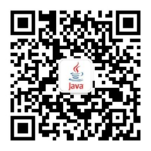

# CSRF的原理与防御 | 你想不想来一次CSRF攻击？

**CSRF**是**Cross Site Request Forgery**的缩写，中文翻译过来是**跨站请求伪造**。这个漏洞往往能给用户带来巨大的损失，**CSRF**在等保安全检测中，也是一个非常重要的检测项。但是在我们的网站中，大部分都没有做CSRF的防御，小伙伴们想不想来一次CSRF攻击，体验一下做黑客感觉？如果想要做黑客，可要仔细的往下看哟~

## CSRF攻击的原理

要想理解CSRF攻击的原理，我们从一个经典的案例出发，看看它是如何进行攻击的。假设你的银行网站的域名是`www.a-bank.com`，这个银行网站提供了一个转账的功能，在这个功能页面中，有一个表单，表单中有两个输入框，一个是转账金额，另一个是对方账号，还有一个提交按钮。当你登录了你的银行网站，输入转账金额，对方账号，点击提交按钮，就会进行转账。

> 当然，现在的银行网站不会有这么简单的转账操作了，我们在这里只是举一个简单的例子，让大家明白CSRF的原理。咱们可以发散思维，联想到其他类似的操作。

这个转账的表单项，如下所示：

```html
<form method="post" action="/transfer">
    <input type="text" name="amount"/>
    <input type="text" name="account"/>
    <input type="submit" value="Transfer"/>
</form>
```

当我们输入金额和账号，点击提交按钮，表单就会提交，给后端的银行网站服务发送请求。请求的内容如下：

```http
POST /transfer HTTP/1.1
Host: www.a-bank.com
Cookie: JSESSIONID=randomid
Content-Type: application/x-www-form-urlencoded

amount=100.00&account=9876
```

请求成功后，你输入的转账金额100元，将转账到9876这个账户当中。假如你完成转账操作后，并没有退出登录，而是访问了一个恶意网站，这时，你的银行网站`www.a-bank.com`还是处于登录状态，而这个恶意网站中，出现了一个带有”赢钱“字样的按钮，这个”赢钱“字样的按钮后面是一个form表单，表单如下：

```html
<form method="post" action="https://www.a-bank.com/transfer">
    <input type="hidden" name="amount" value="100.00"/>
    <input type="hidden" name="account" value="黑客的银行账户"/>
    <input type="submit" value="赢钱!"/>
</form>
```

我们可以看到这个表单中，金额和账户都是隐藏的，在网页上只看到了一个赢钱按钮。这时，你忍不住冲动，点了一个”赢钱“按钮，这时，将会发生什么操作呢？我们仔细看一下上面表单中的`action`写的是什么？`action`写的是你的银行网站的转账请求接口。你点了一下赢钱按钮，在这个不正规的网站中，将会发送`https://www.a-bank.com/transfer`这个请求，在发送这个请求的时候，会自动带上`www.a-bank.com`的cookie，**不要问我为什么是这样，这是浏览器的标准，标准就是这样规定的。**银行后台接到这个请求后，首先要判断用户是否登录，由于携带了cookie，是登录的，会继续执行后面的转账流程，最后转账成功。你点了一下”赢钱“按钮，自己没有赚到钱，而是给黑客转账了100元。

_这就是CSRF攻击的原理，在其他的网站向你的网站发送请求，如果你的网站中的用户没有退出登录，而发送的请求又是一些敏感的操作请求，比如：转账，那么将会给你的网站的用户带来巨大的损失。_

## CSRF的防御

我们知道了CSRF攻击的原理，就可以做针对性的防御了。CSRF的防御可以从两个方面考虑，一个是后台接口层做防御；另一个则是在前端做防御，这种不同源的请求，不可以带cookie。

### 后端防御CSRF

我们先聊聊后端的防御，后端防御主要是区分**哪些请求是恶意请求，哪些请求是自己网站的请求。**区分恶意请求的方式有很多，在这里给大家介绍两种吧。

第一种，CSRF Token的方式。这种方式是**在表单页面生成一个随机数，这个随机数一定要后端生成，并且对这个随机数进行存储。**在前端页面中，对这个Token表单项进行隐藏。代码如下：

```html
<form method="post" action="/transfer">
    <input type="hidden" name="_csrf" value="4bfd1575-3ad1-4d21-96c7-4ef2d9f86721"/>
    <input type="text" name="amount"/>
    <input type="hidden" name="account"/>
    <input type="submit" value="Transfer"/>
</form>
```

`_csrf`就是CSRF Token。我们看到他的value是一个UUID，这个UUID是后台生成的。当用户点击转账按钮时，会给银行的后台发送请求，请求中包含`_csrf`参数，如下：

```http
POST /transfer HTTP/1.1
Host: www.a-bank.com
Cookie: JSESSIONID=randomid
Content-Type: application/x-www-form-urlencoded

amount=100.00&account=9876&_csrf=4bfd1575-3ad1-4d21-96c7-4ef2d9f86721
```

银行后台接收到这个请求后，判断`_csrf`的值是否存在，如果存在则是自己网站的请求，进行后续的流程；如果不存在，则是恶意网站的请求，直接忽略。

第二种，通过请求头中的`referer`字段判断请求的来源。每一个发送给后端的请求，在请求头中都会包含一个`referer`字段，这个字段标识着请求的来源。如果请求是从银行网站发出的，这个字段会是银行网站转账页的链接，比如：`https://www.a-bank.com/transfer-view`；如果是从恶意网站发出的，那么`referer`字段一定不会是银行网站。我们在做后端防御时，可以先取出每个请求的请求头中的`referer`字段，判断是不是以自己网站的域名开头，在咱们的示例中，如果`referer`字段是以`https://www.a-bank.com/`开头的，则继续执行转账操作；如果不是，则直接忽略掉这个请求。

以上就是后端防御CSRF攻击的两种方式，都需要在后端做特殊的处理。当然也可以在前端做处理，怎么做呢？我们接着往下看。

### 前端防御CSRF

既然CSRF攻击的危害这么大，为什么不能在前端禁止这种请求呢？各大浏览器厂商似乎也注意到了这个问题，谷歌提出了same-site cookies概念，same-site cookies 是基于 Chrome 和 Mozilla 开发者花了三年多时间制定的 IETF 标准。它是在原有的Cookie中，新添加了一个`SameSite`属性，它标识着在非同源的请求中，是否可以带上Cookie，它可以设置为3个值，分别为：

* Strict
* Lax
* None

Cookie中的内容为：

```http
POST /transfer HTTP/1.1
Host: www.a-bank.com
Cookie: JSESSIONID=randomid;SameSite=Strict;
```

`Strict`是最严格的，它完全禁止在跨站情况下，发送Cookie。只有在自己的网站内部发送请求，才会带上Cookie。不过这个规则过于严格，会影响用户的体验。比如在一个网站中有一个链接，这个链接连接到了GitHub上，由于SameSite设置为Strict，跳转到GitHub后，GitHub总是未登录状态。

`Lax`的规则稍稍放宽了些，大部分跨站的请求也不会带上Cookie，但是一些导航的Get请求会带上Cookie，如下：

| 请求类型  |                 示例                 |   Lax情况   |
| :-------: | :----------------------------------: | :---------: |
|   链接    |         `<a href="..."></a>`         | 发送 Cookie |
|  预加载   | `<link rel="prerender" href="..."/>` | 发送 Cookie |
| GET 表单  |  `<form method="GET" action="...">`  | 发送 Cookie |
| POST 表单 | `<form method="POST" action="...">`  |   不发送    |
|  iframe   |    `<iframe src="..."></iframe>`     |   不发送    |
|   AJAX    |            `$.get("...")`            |   不发送    |
|   Image   |          ``           |   不发送    |
|           |                                      |             |

上面的表格就是SameSite设置为Lax的时候，Cookie的发送情况。

None就是关闭SameSite属性，所有的情况下都发送Cookie。不过SameSite设置None，还要同时设置Cookie的Secure属性，否则是不生效的。

以上就是在前端通过Cookie的SameSite属性防御CSRF攻击，**不过大家在使用SameSite属性时，要注意浏览器是否支持SameSite属性。**

## 总结

到这里CSRF的攻和防都已经介绍完了，大部分网站都是没有做CSRF防御的，小伙伴们有没有想当黑客的瘾，找几个网站搞一下试试吧~~

