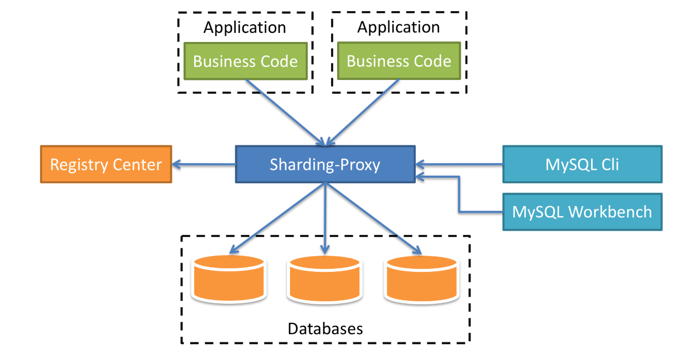

# Sharding-Proxy的基本功能使用

Sharding-Proxy是一个分布式数据库中间件，定位为透明化的数据库代理端。作为开发人员可以完全把它当成数据库，而它具体的分片规则在Sharding-Proxy中配置。它的整体架构图如下：



在架构图中，中间的蓝色方块就是我们的中间件Sharding-Proxy，下面连接的是数据库，我们可以配置每一个数据库的分片，还可以配置数据库的读写分离，影子库等等。上方则是我们的业务代码，他们统一连接Sharding-Proxy，就像直接连接数据库一样，而具体的数据插入哪一个数据库，则由Sharding-Proxy中的分片规则决定。再看看右侧，右侧是一些数据库的工具，比如：MySQL CLI，这是MySQL的命令行；Workbench是MySQL自己出的一个管理工具；还可以连接其他的工具，比如：Navicat，SQLYog等。最后再来看看左侧，是一个注册中心，目前支持最好的是Zookeeper，在注册中心中，我们可以统一配置分片规则，读写数据源等，而且是实时生效的，在管理多个Sharding-Proxy时，非常的方便。而官方也给我们提供了界面化的工具——ShardingSphere-UI，使用起来非常的方便。

## Sharding-Proxy的安装

我们可以在Sharding-Proxy官网上找的下载目录，再找到Sharding-Proxy的下载链接，下载最新版本的二进制包。然后把二进制包（tar.gz）上传到服务器的目录中，这个目录可以自定义，`/opt`或者`/usr/local`都可以，然后解压，命令如下：

```shell
tar -zxvf apache-shardingsphere-4.1.1-sharding-proxy-bin.tar.gz
```

解压后，进入到sharding-proxy的conf目录，这个目录sharding-proxy的配置目录，我们所有的数据源、分片规则、读写分离等都在此目录下配置。

```shell
[root@centOS-1 conf]# ll
总用量 28
-rw-r--r--. 1 root root 3019 6月   4 15:24 config-encrypt.yaml
-rw-r--r--. 1 root root 3633 7月   7 13:51 config-master_slave.yaml
-rw-r--r--. 1 root root 2938 6月   4 15:24 config-shadow.yaml
-rw-r--r--. 1 root root 5463 7月   7 14:08 config-sharding.yaml
-rw-r--r--. 1 root root 1322 6月   4 15:24 logback.xml
-rw-r--r--. 1 root root 2171 7月   7 15:19 server.yaml

```

* logback.xml是日志的配置。
* server.yaml是Sharding-Proxy的一些基础配置，比如：账号、密码、注册中心等。
* 剩下的所有以config开头的yaml文件，都是一个逻辑数据源，我们可以看到最常见的两个config-sharding.yaml（分片的配置），config-master_slave.yaml（读写分离的配置）。注意，如果我们要配置分片+读写分离，要不要在两个配置文件中配置呢？不需要的，我们只需要在config-sharding.yaml中配置就可以了，如果要配置单独的读写分离，则需要按照config-master_slave.yaml配置。单独的读写分离和分片+读写分离在配置上，还是有一些区别的。

这些配置我们在后面会展开讲。Sharding-Proxy默认支持的数据库是PostgreSQL，而我们大多数都是使用的MySQL，在这里我们的数据库使用的是MySQL，我们要将mysql-connector-java.jar这个jar包放入lib目录，这里推荐使用5.x版本的jar包，如果使用8.x可能会有一些位置的错误。

最后，我们执行bin目录下的start.sh就可以运行了。

```shell
 ./bin/start.sh
```

Sharding-Proxy默认的启动端口是3307，我们在连接的时候要格外注意一下。

## server.yaml配置

下面我们看看server.yaml文件中，都具体配置哪些内容，我们用vim打开文件，

```shell
vim server.yaml
```

文件的内容如下：

```yaml
#########################################################################################
# 
# If you want to configure orchestration, authorization and proxy properties, please      refer to this file.
# 
#########################################################################################
#
#orchestration:
#  orchestration_ds:
#    orchestrationType: registry_center,config_center
#    instanceType: zookeeper
#    serverLists: 192.168.73.131:2181
#    namespace: sharding-proxy
#    props:
#      overwrite: false
#      retryIntervalMilliseconds: 500
#      timeToLiveSeconds: 60
#      maxRetries: 3
#      operationTimeoutMilliseconds: 500

authentication:
  users:
    root:
      password: root
    sharding:
      password: sharding
      authorizedSchemas: sharding_db
```

* 其中，orchestration是连接zookeeper注册中心，这里我们暂时用不到，将其注释掉。
* authentication中，配置的是用户名和密码，以及授权的数据库，在这里，我们配置了两个用户，分别为：root/root和sharding/sharding，其中root默认授权所有的数据库，而sharding用户则授权sharding_db数据库。在这里的数据库（schema）是逻辑数据库，在config-*.yaml中配置的。

## config-sharding.yaml的配置

这个文件是Sharding-Proxy的核心的配置，所有的分片规则都在这个文件中配置，让我们一起来看看吧，

```yaml
schemaName: sharding_db

dataSources:
  ds_1:
    url: jdbc:mysql://192.168.73.132:3306/shard_order?serverTimezone=Asia/Shanghai&useSSL=false
    username: imooc
    password: Imooc@123456
    connectionTimeoutMilliseconds: 30000
    idleTimeoutMilliseconds: 60000
    maxLifetimeMilliseconds: 1800000
    maxPoolSize: 50
  master_ds:
    url: jdbc:mysql://192.168.73.131:3306/sharding_order?serverTimezone=Asia/Shanghai&useSSL=false
    username: imooc
    password: Imooc@123456
    connectionTimeoutMilliseconds: 30000
    idleTimeoutMilliseconds: 60000
    maxLifetimeMilliseconds: 1800000
    maxPoolSize: 50
  slave_ds_0:
    url: jdbc:mysql://192.168.73.130:3306/sharding_order?serverTimezone=Asia/Shanghai&useSSL=false
    username: imooc
    password: Imooc@123456
    connectionTimeoutMilliseconds: 30000
    idleTimeoutMilliseconds: 60000
    maxLifetimeMilliseconds: 1800000
    maxPoolSize: 50

```

* 在这个配置文件中，总共分为3个部分，我们先看看前面2个部分。
* schemaName：是逻辑数据库的名称，这里我们叫做sharding_db。在server.yaml文件中，授权的schema就是这里的schemaName。
* 第二部分是数据源，在dataSources里边，我们配置了3个数据源。分别是ds_1、master_ds和slave_ds_0。我们先来说一下数据库的规划吧，我们的数据将通过user_id进行数据库的分片，总共有2个分片，user_id尾数为奇数的将分配到ds_1的数据库中，user_id尾数为偶数的，将分配到ds_0中，但是我们的数据源中没有ds_0呀，ds_0将由master_ds和slave_ds_0组成一个读写分离数据源。

接下来再看看具体分片的配置，

```yaml
shardingRule:
  masterSlaveRules:
    ds_0:
      masterDataSourceName: master_ds
      slaveDataSourceNames:
        - slave_ds_0
  tables:
    t_order:
      actualDataNodes: ds_${0..1}.t_order_${1..2}
      tableStrategy:
        inline:
          shardingColumn: order_id
          algorithmExpression: t_order_${order_id % 2 + 1}
      keyGenerator:
        type: SNOWFLAKE
        column: order_id
    t_order_item:
      actualDataNodes: ds_${0..1}.t_order_item_${1..2}
      tableStrategy:
        inline:
          shardingColumn: order_id
          algorithmExpression: t_order_item_${order_id % 2 + 1}
      keyGenerator:
        type: SNOWFLAKE
        column: id
  defaultDatabaseStrategy:
    inline:
      shardingColumn: user_id
      algorithmExpression: ds_${user_id % 2}
  defaultTableStrategy:
    none:
  defaultDataSourceName: ds_0

```

* 分片的配置都在shardingRule下。
* 在这里我们要配置读写分离主从数据源，在这里我们配置的是分片+读写分离，和单纯的读写分离配置是不一样的。读写分离的配置在masterSlaveRules下，我们配置读写分离数据源ds_0，指定主库的数据源masterDataSourceName为master_ds，master_ds在上面的数据源中已经配置，而从数据源slaveDataSourceNames可以配置多个，也就是一主多从的配置，我们用数组的方式进行配置，- slave_ds_0指定从数据源为slave_ds_0，如果有多个从数据源，可以配置多个。
* 我们先跳过tables的配置，往下看，defaultDataSourceName，默认数据源，我们指定ds_0。这个配置非常有用，在我们的项目中，并不是所有的表都要进行水平切分，只有数据量比较大的表才会用到水平切分，比如：订单表（t_order）和订单明细表（t_order_item）。而其他的表数据量没有那么大，单库单表就可以完全支撑，这些表没有分片规则，而我们指定了默认的数据源，当我们操作这些没有分片规则的表时，都统一使用默认的数据源。
* defaultTableStrategy，默认表的分片规则，这里我们配置的是none，没有。也就是说所有的分片表都要配置表的分片规则。
* defaultDatabaseStrategy，默认数据库的分片规则，这里我们配置它的规则为行内表达式，分片字段为user_id，规则为`ds_${user_id % 2}`，当user_id为偶数时，数据源为ds_0，也就是前面配置的读写分离数据源；而当user_id为奇数时，数据源为ds_1。如果我们的表的分片规则中，没有配置数据源的分片规则，将使用这个默认数据源的分片策略。
* 最后再来看看tables的配置，这里配置的是分片表的规则，我们配置两个表，t_order和t_order_item。每个分片表都由3部分组成。首先，actualDataNodes，实际的数据节点，这个节点是在MySQL中真实存在的，以t_order的配置为例，ds\_${0..1}.t_order\_${1..2}，说明t_order的数据节点有4个，分表为ds_0.t_order_1、ds_0.t_order_2、ds_1.t_order_1和ds_1.t_order_2。再来看表的分片规则，tableStrategy，它的规则也是用行内表达式配置的，分片字段为order_id，规则为t_order_${order_id % 2 + 1}，当order_id为奇数时，数据会分配到表t_order_1中；当order_id为偶数时，会分配到表t_order_2中。

整个的分片策略就配置完了，决定每条数据的具体分片由两个字段决定，user_id决定数据分配到哪一个数据源中，order_id决定数据分配到哪一个表中。这就是分片+读写分离的配置，如果要进行更详细的配置，可以参考官方文档，这里不赘述了。

## config-master_slave.yaml的配置

如果我们只配置数据源的读写分离，而不进行分片配置，就需要参照这个配置文件进行配置了，虽然分片+读写分离的配置已经有了读写分离的配置，但是他俩之间还是有一些细微的区别的，我们来看看这个文件中的内容吧，

```yaml
schemaName: master_slave_db

dataSources:
  master_ds:
    url: jdbc:mysql://192.168.73.131:3306/sharding_order?serverTimezone=Asia/Shanghai&useSSL=false
    username: imooc
    password: Imooc@123456
    connectionTimeoutMilliseconds: 30000
    idleTimeoutMilliseconds: 60000
    maxLifetimeMilliseconds: 1800000
    maxPoolSize: 50
  slave_ds:
    url: jdbc:mysql://192.168.73.130:3306/sharding_order?serverTimezone=Asia/Shanghai&useSSL=false
    username: imooc
    password: Imooc@123456
    connectionTimeoutMilliseconds: 30000
    idleTimeoutMilliseconds: 60000
    maxLifetimeMilliseconds: 1800000
    maxPoolSize: 50
  slave_ds_1:
    url: jdbc:mysql://127.0.0.1:3306/demo_ds_slave_1?serverTimezone=UTC&useSSL=false
    username: root
    password:
    connectionTimeoutMilliseconds: 30000
    idleTimeoutMilliseconds: 60000
    maxLifetimeMilliseconds: 1800000
    maxPoolSize: 50

masterSlaveRule:
  name: ds_0
  masterDataSourceName: master_ds
  slaveDataSourceNames:
    - slave_ds
    - slave_ds_1

```

* 首先，我们还是定义逻辑数据库的名称，schemaName: master_slave_db，叫做master_slave_db。
* 然后在dataSources中定义数据源，这些配置的结构是通用，和前面没有区别，我们配置了3个数据源，一主两从，master_ds（主）、slave_ds（从）和slave_ds_1（从）。
* 最后就是主从的规则masterSlaveRule，在前面分片+读写分离的配置中，叫做masterSlaveRules，复数形式。说明在单独的读写分离配置中，只能配置一个主从数据源。主从数据源的名字叫做ds_0，主数据源masterDataSourceName是master_ds，从数据源slaveDataSourceNames配置了两个，slave_ds和slave_ds_1。

这里只是单纯的配置主从读写分离数据源，如果要配置分片+读写分离，请参照前面的配置。

## config-shadow.yaml影子库配置

在现在微服务盛行的情况下，系统被切分的很细，这对于测试，尤其是压测是非常难的，如果在测试环境部署一套和生产一模一样的环境，是非常浪费资源的。而如果只部署一两个服务，又不能进行全链路的整体压测。而我们的解决方案是在生产环境直接进行压测，得出的结果也是真实有效的。那么这些压测的数据怎么办，如果不做特殊的处理，就和生产的真实数据混在一起了。

这里我们就需要配置影子数据库了，所有压测数据都会有一个特殊的标识，sharding-proxy根据这个特殊的标识，将压测的数据分配到影子库中，和生产的真实数据隔离开，我们看看具体怎么配置

```yaml
schemaName: sharding_db

dataSources:
  ds:
    url: jdbc:mysql://127.0.0.1:3306/demo_ds_0?serverTimezone=UTC&useSSL=false
    username: root
    password:
    connectionTimeoutMilliseconds: 30000
    idleTimeoutMilliseconds: 60000
    maxLifetimeMilliseconds: 1800000
    maxPoolSize: 50
  shadow_ds:
    url: jdbc:mysql://127.0.0.1:3306/demo_ds_1?serverTimezone=UTC&useSSL=false
    username: root
    password:
    connectionTimeoutMilliseconds: 30000
    idleTimeoutMilliseconds: 60000
    maxLifetimeMilliseconds: 1800000
    maxPoolSize: 50

shadowRule:
  column: shadow
  shadowMappings:
    ds: shadow_ds
```

* 前面还是逻辑数据库的名称和数据源的配置。在数据源我们配置了两个，一个是真实的数据库ds，另一个是影子库shadow_ds，所有压测的数据都会分配的影子库中。
* shadowRule中配置影子库的规则，column，影子库字段标识，所有压测数据，在程序中，将此字段设置为true。shadowMappings是主库和影子库的映射关系，ds数据库的影子库是shadow_ds。

影子库的配置在我们压测中还是十分有用的，将测试数据和生产数据隔离开，不会影响到生产数据。

## config-encrypt.yaml数据加密配置

最后我们再看看数据加密的配置，一些用户的信息是不希望在数据库中以明文存在的，比如：用户的身份证号、银行卡号。但是，在使用的时候，我们还要把它解密回来。当然，我们可以在程序中，针对这些字段进行加解密，这里呢，我们看看Sharding-Proxy为我们提供的数据加密配置。我们看一下配置文件，

```yaml
schemaName: encrypt_db

dataSource:
  url: jdbc:mysql://127.0.0.1:3306/demo_ds?serverTimezone=UTC&useSSL=false
  username: root
  password:
  connectionTimeoutMilliseconds: 30000
  idleTimeoutMilliseconds: 60000
  maxLifetimeMilliseconds: 1800000
  maxPoolSize: 50

encryptRule:
  encryptors:
    encryptor_aes: 
      type: aes
      props: 
        aes.key.value: 123456abc
  tables:
    t_card_no:
      columns:
        card_no:
          cipherColumn: card_no_cipher
          encryptor: encryptor_aes

```

* 逻辑库与数据源的配置略过。
* 在加密规则encryptRule中，我们先定义加密算法，encryptor_aes，它的类型是aes，key是123456abc，这个key我们可以修改，但是一旦用这个key产生数据，就不要再改了，如果改了，旧数据就不能正确的解密了。
* 然后在tables中定义加密数据的表t_card_no，加密的列为card_no，这个列是逻辑列，在表中不是真实存在的，当你的sql中无论查询、插入，出现这个字段，都会进行加密处理。而cipherColumn是加密后存储数据的列，encryptor则是加密的规则。例如，我们执行insert into t_card_no (card_no) values ('123456')，card_no列在表t_card_no中并不存在，t_card_no中存在的是card_no_cipher列，我们执行成功后，card_no_cipher列存的是密文数据；当我们执行select card_no from t_card_no 时，虽然表t_card_no没有card_no 列，但是可以将card_no_cipher列解密，card_no 显示解密后的值。

数据加密在实际的应用中还是比较多的。

## 总结

这一篇我们主要介绍了Sharding-Proxy的一些基本功能，下一篇将给大家shardingsphere-ui和注册中心的应用。