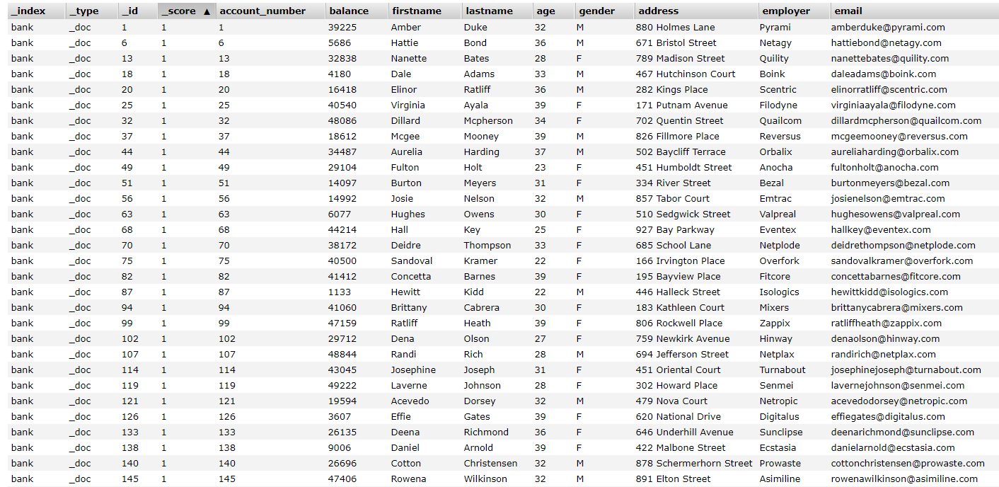

# ES7学习笔记（十）聚合查询

聚合查询，它是在搜索的结果上，提供的一些聚合数据信息的方法。比如：求和、最大值、平均数等。聚合查询的类型有很多种，每一种类型都有它自己的目的和输出。在ES中，也有很多种聚合查询，下面我们看看聚合查询的语法结构，

```shell
"aggregations" : {
    "<aggregation_name>" : {
        "<aggregation_type>" : {
            <aggregation_body>
        }
        [,"meta" : {  [<meta_data_body>] } ]?
        [,"aggregations" : { [<sub_aggregation>]+ } ]?
    }
    [,"<aggregation_name_2>" : { ... } ]*
}
```

`aggregations`实体包含了所有的聚合查询，如果是多个聚合查询可以用数组，如果只有一个聚合查询使用对象，`aggregations`也可以简写为`aggs`。`aggregations`里边的每一个聚合查询都有一个逻辑名称，这个名称是用户自定义的，在我们的语法结构中，对应的是`<aggregation_name>`。比如我们的聚合查询要计算平均价格，这时我们自定义的聚合查询的名字就可以叫做`avg_price`，这个名字要在聚合查询中保持唯一。

在自定义的聚合查询对象中，需要指定聚合查询的类型，这个类型字段往往是对象中的第一个字段，在上面的语法结构中，对应的是`<aggregation_type>`。在聚合查询的内部，还可以有子聚合查询，对应的是`aggregations`，但是只有`Bucketing `类型的聚合查询才可以有子聚合查询。

## metrics 聚合查询

metrics 我觉得在这里翻译成“指标”比较好，也不是太准确，我们还是用英文比较好。metrics 聚合查询的值都是从查询结果中的某一个字段（field）提炼出来的，下面我们就看看一些常用的metrics 聚合查询。我们有如下的一些索引数据，大家先看一下，



索引的名字叫做`bank`，一些关键的字段有`account_number`银行账号，`balance`账户余额，`firstname`和`lastname`等，大家可以直接看出它们代表的含义。假如我们想看看银行里所有人的平均余额是多少，那么查询的语句该怎么写呢？

```shell
POST /bank/_search
{
  "query": {
    "bool": {
      "must": {
        "match_all": {}
      }
    }
  },
  "aggs": {
    "avg_balance": {
      "avg": {
        "field": "balance"
      }
    }
  }
}
```

在查询语句中，查询的条件匹配的是全部，在聚合查询中，我们自定义了一个`avg_balance`的聚合查询，它的类型是`avg`，求平均数，然后我们指定字段是`balance`，也就是我们要计算平均数的字段。我们执行一下，然后看看返回的结果，

```json
{
	"took": 11,
	"timed_out": false,
	"_shards": {
		"total": 1,
		"successful": 1,
		"skipped": 0,
		"failed": 0
	},
	"hits": ……
	"aggregations": {
		"avg_balance": {
			"value": 25714.837
		}
	}
}
```

在返回的结果中，我们看到在`aggregations`中，返回了我们自定义的聚合查询`avg_balance`，并且计算的平均值是`25714.837`。

如果我们要查询`balance`的最大、最小、平均、求和、数量等，可以使用`stats`查询，我们来看一下如何发送这个请求，

```shell
POST /bank/_search
{
  "query": {
    "bool": {
      "must": {
        "match_all": {}
      }
    }
  },
  "aggs": {
    "stats_balance": {
      "stats": {
        "field": "balance"
      }
    }
  }
}
```

我们只需要把前面聚合查询的类型改为`stats`就可以了，我们看一下返回的结果，

```json
{
	"took": 20,
	"timed_out": false,
	"_shards": {
		"total": 1,
		"successful": 1,
		"skipped": 0,
		"failed": 0
	},
	"hits": ……
	"aggregations": {
		"stats_balance": {
			"count": 1000,
			"min": 1011,
			"max": 49989,
			"avg": 25714.837,
			"sum": 25714837
		}
	}
}
```

我们可以看到在返回的结果中，返回了5个字段，我们最常用的最大、最小、平均、求和、数量都包含在内，很方便是不是。

## Bucket 聚合查询

Bucket 聚合不像metrics 那样基于某一个值去计算，每一个Bucket （桶）是按照我们定义的准则去判断数据是否会落入桶（bucket）中。一个单独的响应中，bucket（桶）的最大个数默认是10000，我们可以通过`serarch.max_buckets`去进行调整。

如果从定义来看，理解Bucket聚合查询还是比较难的，而且Bucket聚合查询的种类也有很多，给大家一一介绍不太可能，我们举两个实际中用的比较多的例子吧。在上面的metrics 聚合中，我们可以查询到数量（count），但是我们能不能分组呢？是不是和数据库中的`group by`联系起来了？对，Bucket 聚合查询就像是数据库中的`group by`，我们还用上面银行的索引，比如说我们要看各个年龄段的存款人数，那么查询语句我们该怎么写呢？这里就要使用Bucket 聚合中的Terms聚合查询，查询语句如下：

```shell
POST /bank/_search
{
  "query": {
    "bool": {
      "must": {
        "match_all": {}
      }
    }
  },
  "aggs": {
    "ages": {
      "terms": {
        "field": "age"
      }
    }
  }
}
```

其中，`ages`是我们定义的聚合查询的名称，`terms`指定要分组的列，我们运行一下，看看结果，

```json
……
{
    "aggregations": {
    "ages": {
        "doc_count_error_upper_bound": 0,
        "sum_other_doc_count": 463,
        "buckets": [
            {
                "key": 31,
                "doc_count": 61
            }
            ,
            {
                "key": 39,
                "doc_count": 60
            }
            ,
            {
                "key": 26,
                "doc_count": 59
            }
            ,
            {
                "key": 32,
                "doc_count": 52
            }
            ,
            {
                "key": 35,
                "doc_count": 52
            }
            ,
            {
                "key": 36,
                "doc_count": 52
            }
            ,
            {
                "key": 22,
                "doc_count": 51
            }
            ,
            {
                "key": 28,
                "doc_count": 51
            }
            ,
            {
                "key": 33,
                "doc_count": 50
            }
            ,
            {
                "key": 34,
                "doc_count": 49
            }
        ]
    }
}
```

我们可以看到在返回的结果中，每个年龄的数据都汇总出来了。假如我们要看每个年龄段的存款余额，该怎么办呢？这里就要用到子聚合查询了，在Bucket 聚合中，再加入子聚合查询了，我们看看怎么写，

```shell
POST /bank/_search
{
  "query": {
    "bool": {
      "must": {
        "match_all": {}
      }
    }
  },
  "aggs": {
    "ages": {
      "terms": {
        "field": "age"
      },
      "aggs": {
        "sum_balance": {
          "sum": {
            "field": "balance"
          }
        }
      }
    }
  }
}
```

我们在聚合类型`terms`的后面又加了子聚合查询，在子聚合查询中，又自定义了一个`sum_balance`的查询，它是一个`metrics `聚合查询，要对字段`balance`进行求和。我们运行一下，看看结果。

```json
"aggregations": {
    "ages": {
        "doc_count_error_upper_bound": 0,
        "sum_other_doc_count": 463,
        "buckets": [
            {
                "key": 31,
                "doc_count": 61,
                "sum_balance": {
                    "value": 1727088
                }
            }
            ,
            {
                "key": 39,
                "doc_count": 60,
                "sum_balance": {
                    "value": 1516175
                }
            }
            ,
            {
                "key": 26,
                "doc_count": 59,
                "sum_balance": {
                    "value": 1368494
                }
            }
            ,
            {
                "key": 32,
                "doc_count": 52,
                "sum_balance": {
                    "value": 1245470
                }
            }
            ,
            {
                "key": 35,
                "doc_count": 52,
                "sum_balance": {
                    "value": 1151108
                }
            }
            ,
            {
                "key": 36,
                "doc_count": 52,
                "sum_balance": {
                    "value": 1153085
                }
            }
            ,
            {
                "key": 22,
                "doc_count": 51,
                "sum_balance": {
                    "value": 1261285
                }
            }
            ,
            {
                "key": 28,
                "doc_count": 51,
                "sum_balance": {
                    "value": 1441968
                }
            }
            ,
            {
                "key": 33,
                "doc_count": 50,
                "sum_balance": {
                    "value": 1254697
                }
            }
            ,
            {
                "key": 34,
                "doc_count": 49,
                "sum_balance": {
                    "value": 1313688
                }
            }
        ]
    }
}
```

我们看到返回结果中，增加了我们定义的`sum_balance`字段，它是`balance`余额的汇总。这个例子我们应该对bucket（桶）这个概念有了一个非常形象的认识了。还有一些其他的bucket聚合查询，这里就不给大家一一介绍了，比如：我们只想查某几个年龄段的余额汇总，就可以使用`filters-aggregation`。

好了，ES的一些基本的聚合查询就给大家介绍到这里了，如果要用到一些其他的聚合查询，可以参照ES的官方文档。