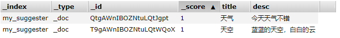

# ES7学习笔记（十二）高亮 和 搜索建议

ES当中大部分的内容都已经学习完了，今天呢算是对前面内容的查漏补缺，把ES中非常实用的功能整理一下，在以后的项目开发中，这些功能肯定是对你的项目加分的，我们来看看吧。

## 高亮

高亮在搜索功能中是十分重要的，我们希望搜索的内容在搜索结果中重点突出，让用户聚焦在搜索的内容上。我们看看在ES当中是怎么实现高亮的，我们还用之前的索引`ik_index`，前面的章节，我们搜索过`香蕉好吃`，但是返回的结果中并没有高亮，那么想要在搜索结果中，对`香蕉好吃`高亮该怎么办呢？我们看看，

```shell
POST /ik_index/_search
{
  "query": {
    "bool": {
      "must": {
        "match": {
          "desc": "香蕉好吃"
        }
      }
    }
  },
  "highlight": {
    "fields": {
      "desc": {}
    }
  }
}
```

我们重点看一下请求体中的`highlight`部分，这部分就是对返回结果高亮的设置，`fields`字段中，指定哪些字段需要高亮，我们指定了`desc`字段，执行一下，看看结果吧。

```json
{
    "took": 73,
    "timed_out": false,
    "_shards": { "total": 1,"successful": 1,"skipped": 0,"failed": 0},
    "hits": {
        "total": {
            "value": 5,
            "relation": "eq"
        },
        "max_score": 1.3948275,
        "hits": [
            {
            "_index": "ik_index",
            "_type": "_doc",
            "_id": "2",
            "_score": 1.3948275,
            "_source": {
                "id": 1,
                "title": "香蕉",
                "desc": "香蕉真好吃"
                },
            "highlight": {
                "desc": [
                        "<em>香蕉</em>真<em>好吃</em>"
                    ]
                }
            }
        ……
```

我们看到在返回的结果中，增加了`highlight`，`highlight`里有我们指定的高亮字段`desc`，它的值是`<em>香蕉</em>真<em>好吃</em>`，其中“香蕉”和“好吃”字段在`<em>`标签中，前端的小伙伴就可以针对这个`<em>`标签写样式了。我们再看看程序当中怎么设置高亮，继续使用上一节中的搜索的程序，

```java
    public void searchIndex() throws IOException {
        SearchRequest searchRequest = new SearchRequest("ik_index");
        SearchSourceBuilder ssb = new SearchSourceBuilder();
        QueryBuilder qb = new MatchQueryBuilder("desc","香蕉好吃");
        ssb.query(qb);
        
        HighlightBuilder highlightBuilder = new HighlightBuilder();
        highlightBuilder.field("desc");

        ssb.highlighter(highlightBuilder);

        searchRequest.source(ssb);
        SearchResponse response = client.search(searchRequest, RequestOptions.DEFAULT);

        SearchHit[] hits = response.getHits().getHits();
        for (SearchHit hit : hits) {
            String record = hit.getSourceAsString();
            HighlightField highlightField = hit.getHighlightFields().get("desc");

            for (Text fragment : highlightField.getFragments()) {
                System.out.println(fragment.string());
            }
        }
    }
```

我们重点关注一下`HighlightBuilder`，我们在发送请求前，创建`HighlightBuilder`，并指定高亮字段为`desc`。搜索结束后，我们取结果，从`hit`当中取出高亮字段`desc`，然后打印出`fragment`，运行一下，看看结果吧，

```shell
<em>香蕉</em>真<em>好吃</em>
<em>香蕉</em>真<em>好吃</em>
橘子真<em>好吃</em>
桃子真<em>好吃</em>
苹果真<em>好吃</em>
```

完全符合预期，“香蕉好吃”被分词后，在搜索结果中都增加了`<em>`标签，我们可不可以自定义高亮标签呢？当然是可以的，我们稍微改一下程序就可以了，

```java
HighlightBuilder highlightBuilder = new HighlightBuilder();
highlightBuilder.field("desc");

highlightBuilder.preTags("<b>");
highlightBuilder.postTags("</b>");

ssb.highlighter(highlightBuilder);

```

在`HighlightBuilder`中，使用`preTags`添加起始标签，指定为`<b>`，用`postTags`添加闭合标签，指定为`</b>`，再运行一下，看看结果，

```shell
<b>香蕉</b>真<b>好吃</b>
<b>香蕉</b>真<b>好吃</b>
橘子真<b>好吃</b>
桃子真<b>好吃</b>
苹果真<b>好吃</b>
```

结果完全正确，用`<b>`替换了`<em>`，是不是很灵活。接下来我们再看看搜索建议。

## 搜索建议

“搜索建议”这个功能也是相当实用的，当我们在搜索框中输入某个字时，与这个字的相关搜索内容就会罗列在下面，我们选择其中一个搜索就可以了，省去了敲其他字的时间。我们看看ES中是怎么实现“搜索建议”的。

如果要在ES中使用“搜索建议”功能，是需要特殊设置的，要设置一个类型为`completion`的字段，由于之前的索引中已经有了数据，再添加字段是会报错的，索引我们新建一个索引，

```json
PUT /my_suggester
{
    "settings":{
        "analysis":{
            "analyzer":{
                "default":{
                    "type":"ik_max_word"
                }
            }
        }
    },
    "mappings":{
        "dynamic_date_formats": [
             "MM/dd/yyyy",
             "yyyy/MM/dd HH:mm:ss",
             "yyyy-MM-dd",
             "yyyy-MM-dd HH:mm:ss"
         ],
        "properties":{
            "suggest":{
                "type":"completion"
            }
        }
    }
}
```

这已经成了我们新建索引的一个标配了，指定分词器为ik中文分词，动态字段的时间映射格式，以及搜索建议字段，注意`suggest`字段的类型为`completion`。我们再添加字段的时候，就要为`suggest`字段添加值了，如下：

```shell
POST /my_suggester/_doc
{
    "title":"天气",
    "desc":"今天天气不错",
    "suggest": {
       "input": "天气"
    }
}

POST /my_suggester/_doc
{
    "title":"天空",
    "desc":"蓝蓝的天空，白白的云",
    "suggest": {
       "input": "天空"
    }
}
```

我们向索引中添加了两条数据，大家需要额外注意的是`suggest`字段的赋值方法，要使用`input`，我们看一下数据，



`suggest`字段并没有像其他字段那样展示出来，说明它和其他字段是不一样的。现在我们如果只输入一个“天”字，看看搜索建议能不能给出提示，如下：

```shell
POST /my_suggester/_search
{
  "suggest": {
    "s-test": {
      "prefix": "天",
      "completion": {
        "field": "suggest"
      }
    }
  }
}
```

在请求体中，`suggest`就是“搜索建议”的标识，`s-test`是自定义的一个名称，`prefix`是前缀，也就是我们输入的“天”字，`completion`指定搜索建议的字段，我们看看查询的结果，

```json
……
"suggest": {
    "s-test": [
        {
            "text": "天",
            "offset": 0,
            "length": 1,
            "options": [{
                "text": "天气",
                "_index": "my_suggester",
                "_type": "_doc",
                "_id": "QtgAWnIBOZNtuLQtJgpt",
                "_score": 1,
                "_source": { "title": "天气","desc": "今天天气不错","suggest": { "input": "天气"}}
        	}
        	,
            {
                "text": "天空",
                "_index": "my_suggester",
                "_type": "_doc",
                "_id": "T9gAWnIBOZNtuLQtWQoX",
                "_score": 1,
                "_source": { "title": "天空","desc": "蓝蓝的天空，白白的云","suggest": { "input": "天空"}}
            }
        ]
        }
    ]
}
```

在`s-test.options`里，包含了两条记录，`text`字段就是我们写的建议字段，后面`_source`里还包含对应的数据，下面我们再看看程序里怎么使用“搜索建议”，

```java
public void searchSuggest(String prefix) throws IOException {
    SearchRequest searchRequest = new SearchRequest("my_suggester");
    SearchSourceBuilder ssb = new SearchSourceBuilder();

    CompletionSuggestionBuilder suggest = SuggestBuilders
        .completionSuggestion("suggest")
        .prefix(prefix);

    SuggestBuilder suggestBuilder = new SuggestBuilder();
    suggestBuilder.addSuggestion("s-test",suggest);

    ssb.suggest(suggestBuilder);

    searchRequest.source(ssb);
    SearchResponse response = client.search(searchRequest, RequestOptions.DEFAULT);

    CompletionSuggestion suggestion = response.getSuggest().getSuggestion("s-test");
    for (CompletionSuggestion.Entry.Option option : suggestion.getOptions()) {
        System.out.println(option.getText().string());
    }

}

@Test
public void searchSuggest() throws IOException {
    eService.searchSuggest("天");
}
```

我们创建了`CompletionSuggestionBuilder`，通过方法`completionSuggestion`指定“搜索建议”字段`suggest`，并且指定前缀为方法传入的`prefix`，我们在测试的时候传入"天"字。然后，我们自定义“搜索建议”的名字为`s-test`，传入前面构造好的`suggest`。

发送请求后，在响应中获取前面自定义的`s-test`，然后循环`options`，取出`text`字段，这就是搜索建议的字段，我们运行一下，看看结果，

```shell
天气
天空
```

完全符合预期，这样用户在搜索的时候，就会给出提示信息了。

好了，今天这两个ES的知识点就全部OK了~ 大家有问题在评论区留言。


