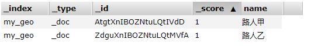

# ES7学习笔记（十三）GEO位置搜索

ES的基本内容介绍的已经差不多了，最后我们再来看看**GEO位置搜索**，现在大部分APP都有基于位置搜索的功能，比如：我们点外卖，可以按照离我们的距离进行排序，这样可以节省我们的配送费和送餐的时间；还有找工作时，也可以按照离自己家的距离进行排序，谁都想找个离家近的工作，对吧。这些功能都是基于GEO搜索实现的，目前支持GEO搜索功能的中间件有很多，像MySQL、Redis、ES等。我们看看在ES当中怎么实现GEO位置搜索。

## GEO字段的创建

GEO类型的字段是不能使用动态映射自动生成的，我们需要在创建索引时指定字段的类型为`geo_point`，`geo_point`类型的字段存储的经纬度，我们看看经纬度是怎么定义的，

|      | 英文      | 简写     | 正数 | 负数 |
| ---- | --------- | -------- | ---- | ---- |
| 维度 | latitude  | lat      | 北纬 | 南纬 |
| 经度 | longitude | lon或lng | 东经 | 西经 |

经度的简写有2个，一般常用的是lon，lng则在第三方地图的开放平台中使用比较多。下面我们先创建一个带有`geo_point`类型字段的索引，如下：

```shell
PUT /my_geo
{
    "settings":{
        "analysis":{
            "analyzer":{
                "default":{
                    "type":"ik_max_word"
                }
            }
        }
    },
    "mappings":{
        "dynamic_date_formats":[
            "MM/dd/yyyy",
            "yyyy/MM/dd HH:mm:ss",
            "yyyy-MM-dd",
            "yyyy-MM-dd HH:mm:ss"
        ],
        "properties":{
            "location":{
                "type":"geo_point"
            }
        }
    }
}
```

创建了一个my_geo索引，在索引中有一些基础的配置，默认IK分词器，动态映射的时间格式。重点是最后我们添加了一个字段location，它的类型是`geo_point`。

索引创建完了，我们添加两条数据吧，假设，路人甲在北京站，路人乙在朝阳公园。那么我们怎么“北京站”和“朝阳公园”的经纬度呢？我们在做项目时，前端都会接地图控件，经纬度的信息可以调用地图控件的API获取。在咱们的示例中，也不接地图控件了，太麻烦了，直接在网上找到“北京站”和“朝阳公园”的坐标吧。

我们查到“北京站”的坐标如下：


然后添加一条数据：

```shell
POST /my_geo/_doc
{
    "name":"路人甲",
    "location":{
        "lat": 39.90279998006104,
        "lon": 116.42703999493406
    }
}
```

再查“朝阳公园”的坐标


再添加“路人乙”的信息

```shell
POST /my_geo/_doc
{
    "name":"路人乙",
    "location":{
        "lat": 39.93367367974064,
        "lon": 116.47845257733152
    }
}
```

我们再用`elasticsearch-head`插件看一下索引中的数据：





## GEO查询

“路人甲”和“路人乙”的信息都有了，但是没有`location`字段的信息，因为`location`是特性类型的字段，在这里是展示不出来的。我们搜索一下吧，看看怎么用geo搜索，假设“我”的位置在“工体”，我们先要查到“工体”的坐标，


然后再查询5km范围内都有谁，发送请求如下：

```shell
POST /my_geo/_search
{
    "query":{
        "bool":{
            "filter":{
                "geo_distance":{
                    "distance":"5km",
                    "location":{
                        "lat":39.93031708627304,
                        "lon":116.4470385453491
                    }
                }
            }
        }
    }
}
```

在查询的时候用的是`filter`查询，再filter查询里再使用`geo_distance`查询，我们定义距离`distance`为5km，再指定geo类型的字段`location`，当前的坐标为：39.93031708627304N，116.4470385453491E。查询一下，看看结果：

```json
{
    ……
    "hits":[
        {
            "_index":"my_geo",
            "_type":"_doc",
            "_id":"AtgtXnIBOZNtuLQtIVdD",
            "_score":0,
            "_source":{
                "name":"路人甲",
                "location":{
                    "lat": 39.90279998006104,
        			"lon": 116.42703999493406
                }
            }
        },
        {
            "_index":"my_geo",
            "_type":"_doc",
            "_id":"ZdguXnIBOZNtuLQtMVfA",
            "_score":0,
            "_source":{
                "name":"路人乙",
                "location":{
                    "lat": 39.93367367974064,
        			"lon": 116.47845257733152
                }
            }
        }
    ]
}
```

看来，我们站在“工体”，“北京站”的路人甲和“朝阳公园”的路人乙都在5km的范围内。把范围缩短一点如何，改为3km看看，搜索的请求不变，只是把`distance`改为3km，看看结果吧，

```json
{
    ……
    "hits":[
        {
            "_index":"my_geo",
            "_type":"_doc",
            "_id":"ZdguXnIBOZNtuLQtMVfA",
            "_score":0,
            "_source":{
                "name":"路人乙",
                "location":{
                    "lat": 39.93367367974064,
        			"lon": 116.47845257733152
                }
            }
        }
    ]
}
```

只有在“朝阳公园”的路人乙被搜索了出来。完全符合预期，我们再看看程序中怎么使用GEO搜索。

## JAVA 代码

在定义实体类时，对应的GEO字段要使用特殊的类型，如下：

```java
@Setter@Getter
public class MyGeo {

    private String name;
    private GeoPoint location;

}
```

location的类型是`GeoPoint`，添加数据的方法没有变化，转化成Json就可以了。再看看查询怎么用，

```java
public void searchGeo() throws IOException {
    SearchRequest searchRequest = new SearchRequest("my_geo");
    SearchSourceBuilder ssb = new SearchSourceBuilder();

    //工体的坐标
    GeoPoint geoPoint = new GeoPoint(39.93367367974064d,116.47845257733152d);
    //geo距离查询  name=geo字段
    QueryBuilder qb = QueryBuilders.geoDistanceQuery("location")
        //距离 3KM
        .distance(3d, DistanceUnit.KILOMETERS)
        //坐标工体
        .point(geoPoint);

    ssb.query(qb);
    searchRequest.source(ssb);
    SearchResponse response = client.search(searchRequest, RequestOptions.DEFAULT);

    for (SearchHit hit : response.getHits().getHits()) {
        System.out.println(hit.getSourceAsString());
    }


}
```

* SearchRequest指定索引`my_geo`
* 创建工体的坐标点`GeoPoint`
* 创建geo距离查询，指定geo字段`location`，距离3km，坐标点工体
* 其他的地方没有变化

运行一下，看看结果，

```shell
{"name":"路人乙","location":{"lat":39.93360786576342,"lon":116.47853840802}}
```

只有在“朝阳公园”的路人乙被查询了出来，符合预期。

## 距离排序

有的小伙伴可能会有这样的疑问，我不想按照距离去查询，只想把查询结果按照离“我”的距离排序，该怎么做呢？再看一下，

```java
public void searchGeoSort() throws IOException {
    SearchRequest searchRequest = new SearchRequest("my_geo");
    SearchSourceBuilder ssb = new SearchSourceBuilder();

    //工体的坐标
    GeoPoint geoPoint = new GeoPoint(39.93367367974064d,116.47845257733152d);

    GeoDistanceSortBuilder sortBuilder = SortBuilders
        .geoDistanceSort("location", geoPoint)
        .order(SortOrder.ASC);

    ssb.sort(sortBuilder);
    searchRequest.source(ssb);
    SearchResponse response = client.search(searchRequest, RequestOptions.DEFAULT);

    for (SearchHit hit : response.getHits().getHits()) {
        System.out.println(hit.getSourceAsString());
    }
}
```

这次查询并没有设置查询条件，而是创建了一个geo距离排序，同样，先指定geo字段`location`，和当前的坐标工体，再设置排序是升序。运行一下，看看结果，

```shell
{"name":"路人乙","location":{"lat":39.93360786576342,"lon":116.47853840802}}
{"name":"路人甲","location":{"lat":39.902799980059335,"lon":116.42721165631102}}
```

离“工体”比较近的“路人乙”排在了第一个，也是符合预期的。有问题大家评论区留言吧~

