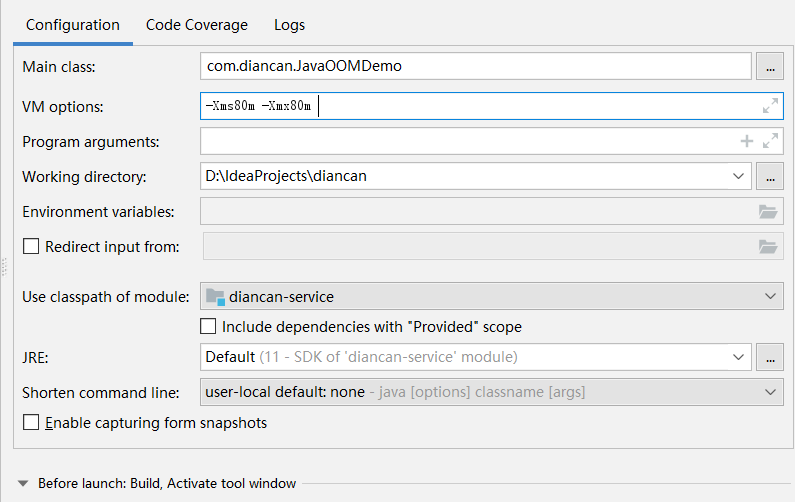
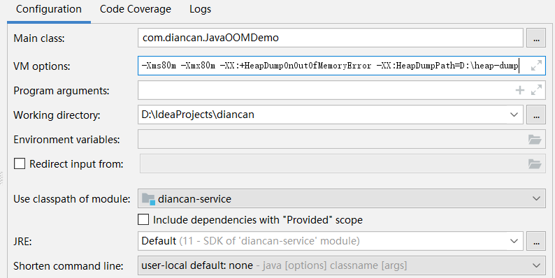
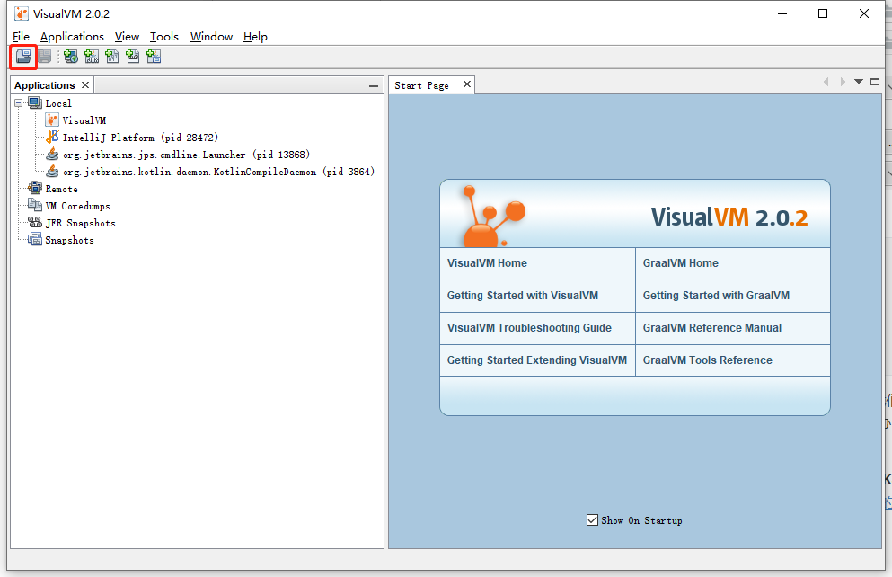
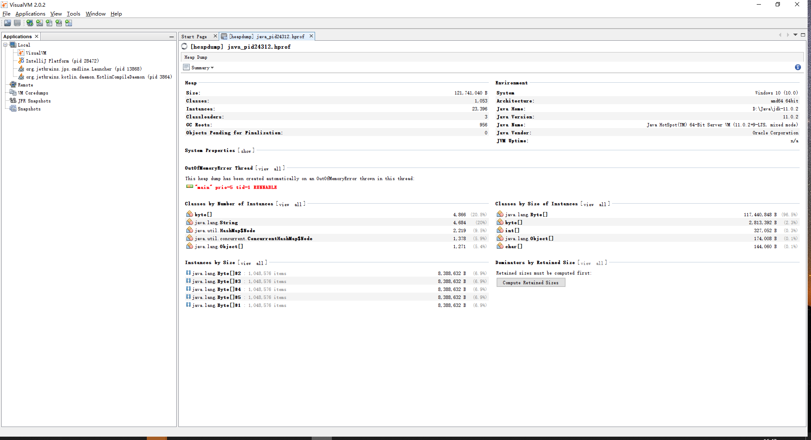
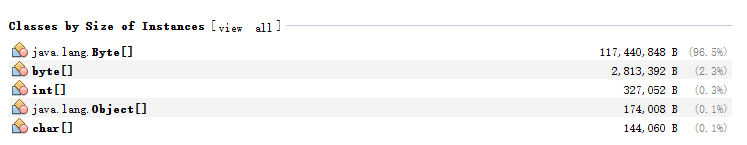

# Java内存溢出OutOfMemoryError的产生与排查

在java的虚拟机异常中，有两个异常是大家比较关心的，一个是**StackOverflowError**，另一个是**OutOfMemoryError**。今天我们就来看看**OutOfMemoryError**是怎么产生的，以及如何去排查这个异常。

## 概念

要了解什么是OutOfMemoryError，我们可以直接看一下OutOfMemoryError的源码，在类上的英文注释很好的阐述了什么是OutOfMemoryError，翻译过来的意思是，**由于内存不足，虚拟机没有可分配的内存了，垃圾回收器也不能释放更多的内存。**在生产环境中，由于访问量过大，把内存吃满，会出现OutOfMemoryError的异常，小伙伴们如果没有经验的话，往往束手无策，到底是真的内存不够用了，还是自己的程序有问题，也不知道如何去排查这样的异常。

## 模拟OutOfMemoryError

在这里，我们写一段程序，来模拟一下OutOfMemoryError如何产生，我们创建一个List对象，然后向里边不停的添加1M的Byte，如下；

```java
 public static void main(String[] args) {
     List<Byte[]> list = new ArrayList<>();
     int i = 0;
     try {
         while (true) {
             list.add(new Byte[1024 * 1024]);
             i++;
         }
     } catch (Throwable e) {
         e.printStackTrace();
         System.out.println("执行了"+i+"次");
     }
 }
```

* 我们写了一个while(true)循环，每次都add一个1M的字节对象，1024*1024正好1M。
* 我们用i的值记录总共执行了几次。
* 如果这样不停的执行下去，不管你有多大的内存，都会被吃光的。

我们为了让程序运行时，快速的抛出OutOfMemoryError异常，可以在java的启动命令行增加启动参数，设置堆内存的初始值和最大值。这两个值在生产环境下，通常也是要配置的哦，要充分利用机器的内存嘛，如果不配置就会使用默认值。到时候由于内存不足向老板申请机器，可别挨骂哦~

那这两个参数怎么去加呢？

* **-Xms ，-Xms设置初始堆内存的大小**
* **-Xmx， -Xmx设置最大堆内存的大小**

通常情况下，这两个值设置成一样就可以了，总之，我们设置了堆内存的大小。我们在IDEA的启动配置中，统一设置堆内存为80M，如下；



好了~~我们运行一下，看看会不会抛出OutOfMemoryError异常吧

```shell
java.lang.OutOfMemoryError: Java heap space
	at com.diancan.JavaOOMDemo.main(JavaOOMDemo.java:14)
执行了14次
```

执行了14次，抛出了OutOfMemoryError异常。但是，如果抛出这样一个异常，我们怎么去排查呢？就这一行日志也看不出什么来啊。

## 排查

说到排查，如果我们能够拿到异常时的内存快照，然后通过一些工具就可以了进行内存的分析了。那么我们怎么去拿到内存溢出时的快照呢？其实，JDK也为我们提供了这样的命令参数，我们来看一下吧，

* **-XX:+HeapDumpOnOutOfMemoryError，从字面就可以很容易的理解，在发生OutOfMemoryError异常时，进行堆的Dump，这样就可以获取异常时的内存快照了。**
* **-XX:HeapDumpPath=D:\heap-dump\ ，这个也很好理解，就是配置HeapDump的路径，方便我们管理，这里我们配置为D:\heap-dump，当然你也可以根据自己的需要，定义为其他的目录。**

> 注意，HeapDumpPath的目录一定要手动创建好，如果没有这个目录，Dump会失败的。

IDEA中的配置，如图：



我们再运行一下程序，看看是什么样子，

```shell
java.lang.OutOfMemoryError: Java heap space
Dumping heap to D:\heap-dump\java_pid24312.hprof ...
Heap dump file created [123468648 bytes in 0.141 secs]
java.lang.OutOfMemoryError: Java heap space
	at com.diancan.JavaOOMDemo.main(JavaOOMDemo.java:14)
执行了14次
```

我们发现日志上面多了点东西，创建了一个文件，在D:\heap-dump\java_pid24312.hprof。这个文件就是我们的内存快照。那么问题来了，我们如何查看这个文件呢？直接打开是不行的，用写字板等也是不行的，那怎么办？其实也没那么复杂，使用JDK自带的jvisualvm就可以查看。

**这里边有个小坑，如果大家用JDK8，可以在JDK的bin目录下找到`jvisualvm.exe`，但是如果你使用的是JDK8以上的版本，就本示例中，使用的是JDK11，在bin目录下是找不到`jvisualvm.exe`的。**大家可以去[visualvm的主页](http://visualvm.github.io/)下载。

我们启动visualvm，进入到如下的页面，



然后，点击左上角的加载快照按钮，然后选择刚才我们Dump的文件，



我们重点看一下右侧中间的部分，



类的实例大小排序，可以看到，我们的Byte占了96.5%。详细的信息，我们可以点进去看，包括变量里存的内容，这样我们就可以很快的定位到内存溢出的位置，并且可以判断是真的内存不够了，还是我们的代码出了问题。

