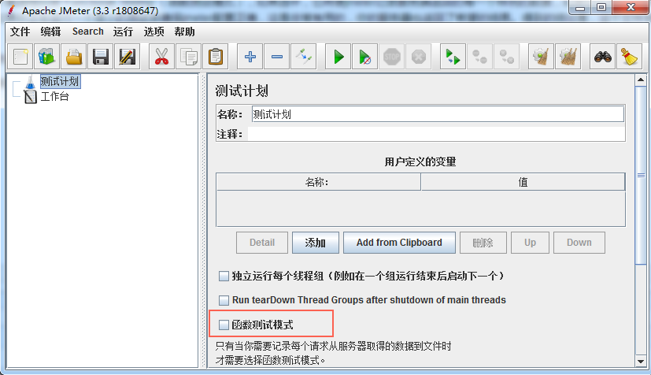
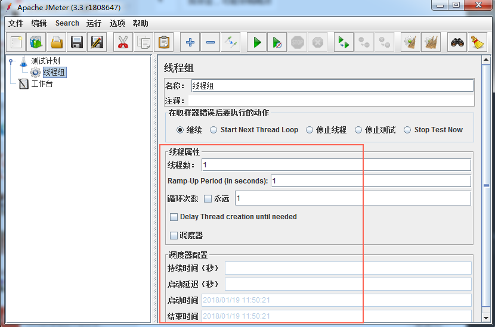
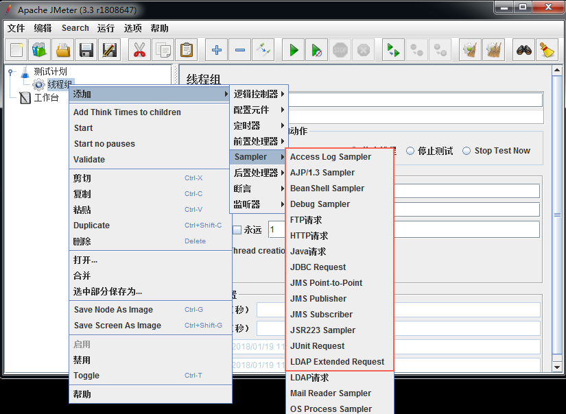
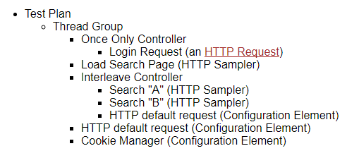
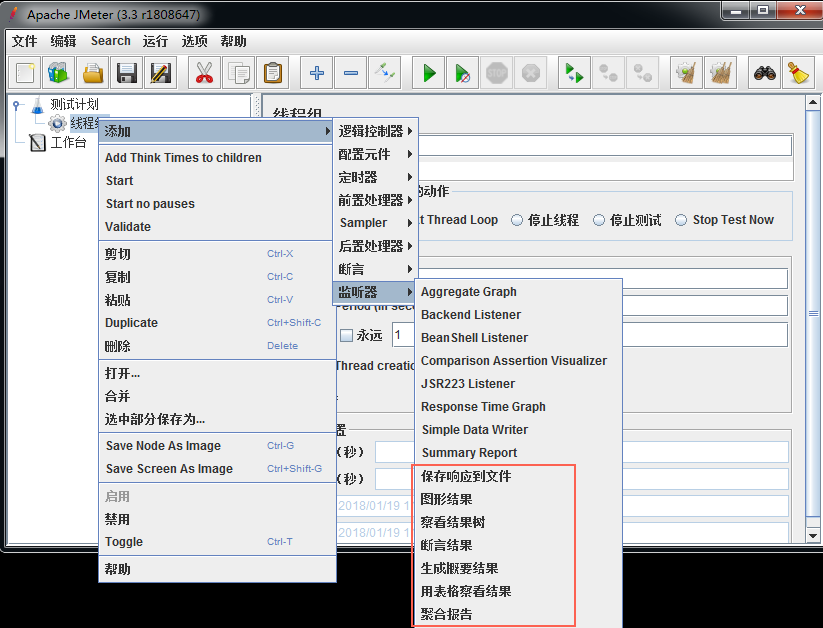

## 一、测试计划

测试计划对象有一个复选框叫做“Functional Testing”（函数测试模式），如果选中，它将使jmeter记录服务端返回的每一个样例的数据，如果你在测试监听器中选择了一个文件，数据将会写到这个文件。如果你正在运行一个很小的测试来确保jmeter配置正确，这是非常有用的，你的服务器也返回了希望的结果。得到的结论是，这个文件会快速的变的很大，jmeter性能将受到影响。

如果你正在做压力测试，这个选项建议关掉（它默认是关掉的）。

如果你没有记录数据到文件，这个选项不会有效果。你也可以在监听器中配置哪些字段要存储。

## 二、线程组

线程组元素是任何测试计划的开始点。所有的控制器和样本器必须在一个线程组下。其他元素，例如：监听器可以直接放在测试计划下，这样的话，它将应用于所有的线程组。顾名思义，线程组元素控制着线程的数量，jmeter将使用这些线程执行你的测试。线程组的管理允许你做如下的事情：
1. 设置线程的数量；
2. 设置提升的周期；
3. 设置执行测试的次数；
每一个线程都将独立于其他线程，完整的、完全的执行测试计划。多个线程被用来模拟并发连接到服务应用。提升周期告诉jmeter花费多长时间提升到所有的线程数，如果线程数设置为10，提升周期设置为100秒，jmeter将花费100秒唤起10个线程并且运行。每一个现场将在前一个线程开始10（100/10）秒后开始。如果有30个线程，提升周期设置为120，每一个连续的线程将会延迟4秒。提升周期需要足够的长以避免测试开始时，巨大的工作负载，并且使得最后一个线程开始间隔第一个线程结束足够的短。

提升周期 = 线程的数量做上下调整

默认的，线程组配置只执行一次。线程组也提供了一个调度器。点击线程组底部的复选框，可以使额外的区域有效或失效，那些区域可以输入测试的周期、启动延迟、启动开始时间和结束时间。你可以配置持续时间和启动延迟控制每一个线程组的持续时间和多少秒后启动。当测试开始后，jmeter将等待启动延迟时间后，启动启动线程组中的线程，并且执行配置的持续时间。这两个选项将覆盖掉配置的开始时间和结束时间。或者（虽然没有推荐哪个更适合）你可以设置其他的两个域，开始时间和结束时间。当测试开始以后，jmeter等待到达开始时间。在每一个周期的结尾，jmeter检查结束时间是否已经到达，如果到了，运行将停止，否则，测试将继续进行直到循环结束。

## 三、控制器

jmeter有两种类型的控制器：样本器和逻辑控制器。他们驾驭着测试的进程。样本器告诉jmeter发送请求给服务，例如：添加http请求样本，如果你想jmeter发送http请求。你也可以通过给样本器添加一个或多个配置元素定制请求。逻辑控制器让你定制逻辑，jmeter使用这个逻辑决定什么时候发送请求。例如：你可以添加交替逻辑控制器交替执行两个http请求样本。

### 3.1 样本器

样本器告诉jmeter发送请求给服务并且等待相应。他们按照在树中出现的顺序执行。控制器可以用来修改样本器的重复次数。jmeter的样本器包含：
* FTP Request
* HTTP Request (can be used for SOAP or REST Webservice also)
* JDBC Request
* Java object request
* JMS request
* JUnit Test request
* LDAP Request
* Mail request
* OS Process request
* TCP request

每一个样本器都有几个可以设置的属性。你可以在测试计划中添加一个或更多的配置元素定制样本器。如果你打算发送同一种类型的多个请求到相同的服务，可以考虑使用默认的配置元素。每一个控制器都有一个或多个默认元素。记得为你的测试计划添加一个监听器来观看和存储每一个请求的结果到硬盘上。如果你对jmeter平台的响应的基本验证感兴趣，添加一个断言器到样本器。例如：压力测试一个web应用，服务返回一个成功的http响应码，但是页面可能有错误或者缺失了一部分。你可以添加断言器确定http的标签。通用的错误字符串等。jmeter让你通过正则表达式创建断言器。

### 3.2 逻辑控制器

逻辑控制器可以改变来自子元素的请求顺序。他们可以修改自己的请求，使jmeter重复请求。为了了解测试计划中逻辑控制器的效果，看一下下面的测试树：

这个测试计划的第一个事情就是只执行一次的登录请求，随后的迭代将跳过这一步，这是仅执行一次控制器的效果。登录之后，下一个样本器将加载搜索页，这是一个简单的请求，没有通过逻辑控制器。加载搜索页之后，我们想执行一次搜索。实际上我们想执行两个不同的搜索，可是，我们想在两次搜索之间重新加载搜索页，我们可以通过4个简单的http请求元素来执行（加载搜索页、搜索A、加载搜索页、搜索B）。在这里，我们使用代替方案，使用交替控制器，它一次传递一个子请求通过测试，它保持着子元素的顺序。交替两个子请求可能过于频繁了，但它也可以很容易的有8个，或者20个子请求。

提醒一下，http默认请求 是属于交替控制器的，设想一下，搜索A和搜索B共享相同的路径信息，两个搜索请求，命中相同的后端搜索引擎。相比配置两个相同信息的http样本器，我们可以抽象出信息到一个单一的配置元素。当交替控制器传递请求时，它会用http默认请求中的值去填充空白项。所以我们将那些请求的PATH项空白，把这些信息放到配置元素中。这充其量只是一个小小的好处，但是它展示了这个特性。

树中的下一个请求是另外一个http默认请求，这次是添加到线程组本身。线程组有一个内嵌的逻辑控制器。它使用这个元素像上面描述的那样。它填充任何请求的空白信息。它在web测试中非常的有用，在你所有的http请求样本器中省去域名项，把这些信息放到http默认请求元素中，并添加到线程组中。你可以在不同的服务上测试你的应用，而仅仅修改一个配置项，否则你要编辑每一个样本器。

最后一个元素是http cookie管理器，cookie管理器应该添加到所有的web测试中，否则jmeter将会忽略cookie，将他添加到线程组的级别，我们确保了所有的http请求共享相同的cookie。

## 四、测试碎片

测试碎片元素是一个特殊类型的控制器，它存在测试计划树中，和线程组有相同的级别。它区别与线程组的地方就是除非它包含在模块控制器或者include控制器，否则他不会被执行。

这个元素就是为了测试复用的。

## 五、监听器

监听器提供了访问jmeter收集的测试用例的信息。图结果监听器在图上绘制响应的次数。视图结果树展示请求和响应的细节，还可以显示响应的xml和html。其他的监听器提供总结和聚集的信息。

另外的，监听器可以将数据传输的文件中为以后使用呢。jmeter的每一个监听器都可以指定文件的路径。也有一个配置按钮可以选择哪个文件保存。监听器可以在测试的任何地方添加，直接包含在测试计划下。它自从它的这个级别以下的元素中获取数据。

JMeter的一些基础元素介绍完了，下一篇将介绍如何使用。