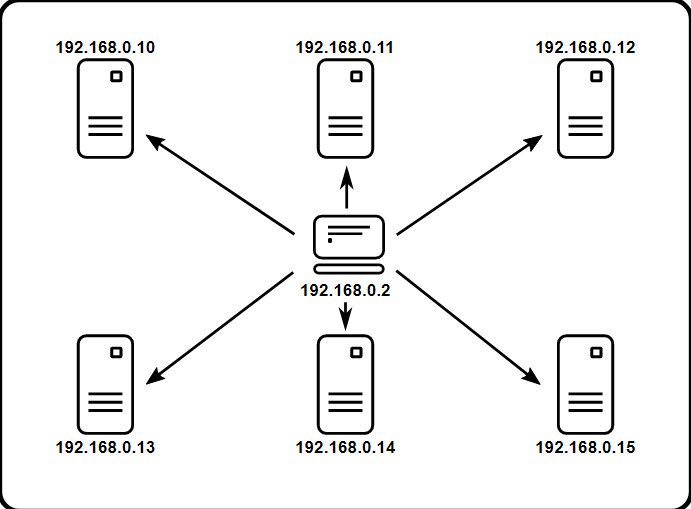
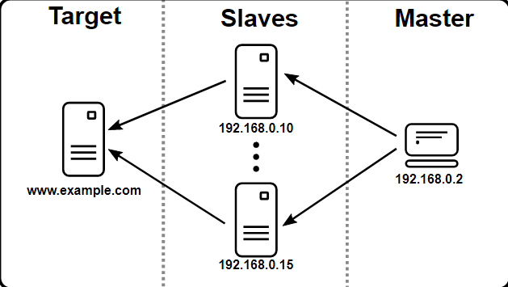
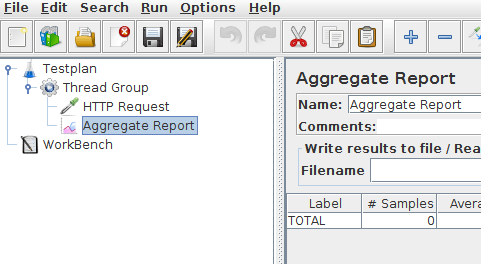
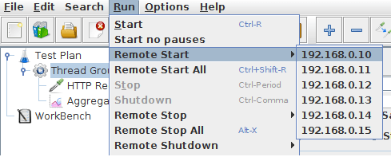
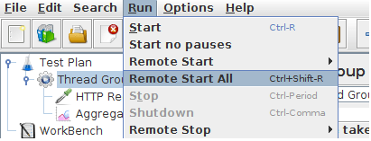

这篇文件将介绍如何使用多系统执行压力测试。在开始之前，我们有几件事情要确定一下。

* 系统的防火墙关闭，或者开放正确的端口；
* 所有的客户端在相同的子网内；
* 如果使用192或10网段开头的ip地址，则服务在同一个子网内；如果不使用192或10开头的ip地址，也应该在同一网段内。
* 确定jmeter可以访问服务。
* 确定所有系统都适用相同的jmeter和java版本；混合的版本将不能正确的工作。

一旦你确定系统无误，就可以设定远程测试了。这篇教程建议你在所有的系统上安装了jmeter。这种方式，jmeter将在主控制器工作，在多个子系统上执行测试。

在这里，我们使用GUI的模式进行示例，在真实环境中，你应该使用非GUI模式执行你的负载测试。



## 一、专用术语

在深入介绍之前，我们还是定义一下专用术语，并使它们的定义清晰。

* 主：运行着JMeter GUI的系统，它控制着测试。
* 从：运行着jmeter-server的系统，它从GUI那里取得命令，并发送请求给目标系统。
* 目标：我们要进行压力测试的web服务。



## 二、搭建步骤

1. 在子系统中，进入jmeter/bin目录，并执行jmeter-server.bat（在unix系统上执行jmeter-server）。
2. 主系统作为控制台，打开资源管理器，进入到jmeter/bin目录。
3. 在文本编译器中打开jmeter.properties。
4. 编辑remote_hosts=127.0.0.1这行。
5. 添加子系统的ip地址，多个用“,”隔开。
　　　　例如：remote_hosts=192.168.0.10,192.168.0.11,192.168.0.12,192.168.0.13,192.168.0.14

6. 运行JMeter；
7. 打开你想用的测试计划。



## 三、开始测试

此时此刻，你准备开始负载测试了。如果你想仔细检查子系统的工作，在编辑器中打开jmeter.log。你将开到如下的log:

```
Writing log file to: /XXXX/XXXXX/bin/jmeter-server.log
Created remote object: UnicastServerRef [liveRef: [endpoint:[192.X.X.X:XXXXX](local),objID:[-6a665beb:15a2c8b9419:-7fff, 3180474504933847586]]]
```
如果你没有看到这样的信息，它意味着jmeter-server没有正确开始。发起测试有两种方式，单个系统和所有系统。

## 四、运行一个子系统

1. 在顶部导航栏单击运行；
2. 选择远程启动；
3. 选择要启动的远程ip地址。



## 五、运行所有子系统

1. 在顶部导航栏单击运行；
2. 点击远程全部启动；



## 六、局限性

分布式测试有一些基本的局限性。下面列出了一些已知的局限性：
1. 没有子网，RMI不能在子网中通信。因此JMeter没有代理是不行的。
2. 从2.9版本开始，JMeter发送所有剥离了响应数据的结果到控制台，这使我们降低了网络IO的影响。
　　　　确保你监控你的网络流量，使得网络不是争议点。
3. 在2-3GHz的CPU上，单个JMeter客户端根据测试的类型 可以 处理 1000-2000的线程。

JMeter分布式测试就介绍完了，大家可以动手试一试了~~
