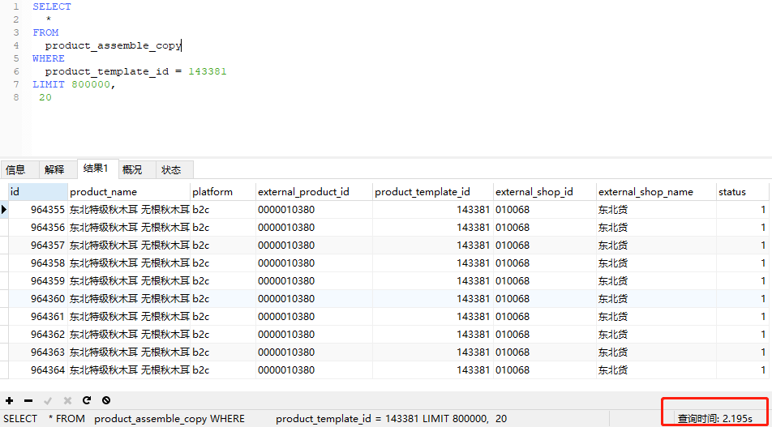
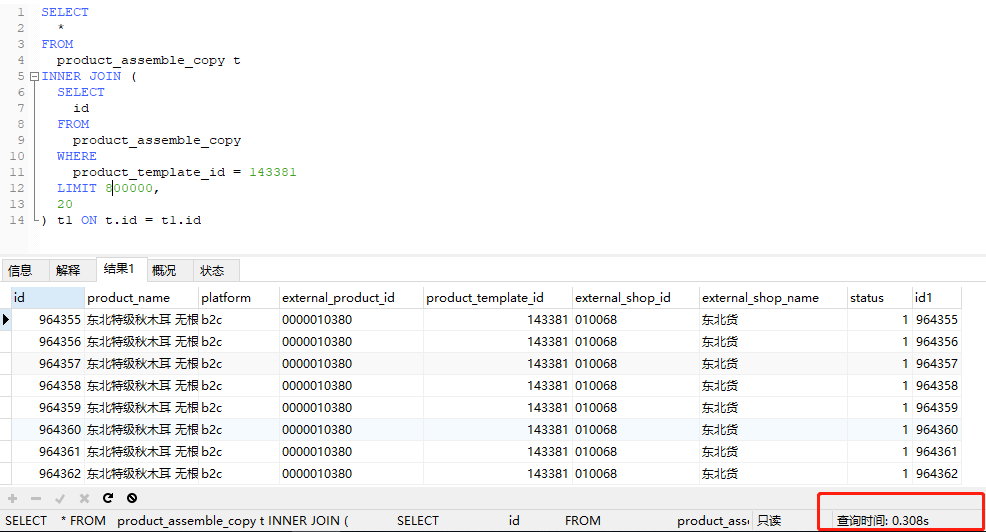

## 背景

我们在开发的过程中使用分页是不可避免的，通常情况下我们的做法是使用limit加偏移量：
`select * from table where column=xxx order by xxx limit 1,20`。
当数据量比较小时（100万以内），无论你翻到哪一页，性能都是很快的。如果查询慢，只要在
where条件和order by 的列上加上索引就可以解决。但是，当数据量大的时候（小编遇到的情况
是500万数据），如果翻到最后几页，即使加了索引，查询也是非常慢的，这是什么原因导致的呢？我们该如何解决呢？

## limit分页原理

当我们翻到最后几页时，查询的sql通常是：`select * from table where column=xxx order by xxx limit 1000000,20`。
查询非常慢。但是我们查看前几页的时候，速度并不慢。这是因为limit的偏移量太大导致的。
MySql使用limit时的原理是（用上面的例子举例）：

1. MySql将查询出1000020条记录。
2. 然后舍掉前面的1000000条记录。
3. 返回剩下的20条记录。

上述的过程是在《高性能MySql》书中确认的。

## 解决方案

解决的方法就是尽量**使用索引覆盖扫描**，就是我们select后面检出的是索引列，而不是
所有的列，而且这个索引的列最好是id。然后再做一次关联查询返回所有的列。
上述的sql可以写成：
```sql
SELECT
	*
FROM
	table t
INNER JOIN (
	SELECT
		id
	FROM
		table
	WHERE
		xxx_id = 143381
	LIMIT 800000,20
) t1 ON t.id = t1.id
```
我们在mysql中做的真实的实验：




上图是没有优化过的sql，执行时间为2s多。经过优化后如下：



执行时间为0.3s，性能有了大幅度的提升。虽然做了优化，但是随着偏移量的增加，性能也会随着下降，MySql官方虽然也给出了
其他的解决方案，但是在实际开发中很难使用。

**有的同学可能会问，能不能使用`IN`嵌套子查询，而不使用`INNER JOIN`的方式，答案是不可以，因为MySql在子查询中不能使用`LIMIT`。**

MySql分页优化就先介绍到这里了。


