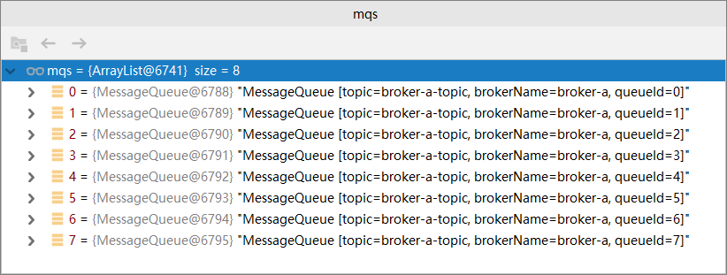

# RocketMQ系列（四）顺序消费

折腾了好长时间才写这篇文章，顺序消费，看上去挺好理解的，就是消费的时候按照队列中的顺序一个一个消费；而并发消费，则是消费者同时从队列中取消息，同时消费，没有先后顺序。RocketMQ也有这两种方式的实现，但是在实践的过程中，就是不能顺序消费，好不容易能够实现顺序消费了，发现采用并发消费的方式，消费的结果也是顺序的，顿时就蒙圈了，到底怎么回事？哪里出了问题？百思不得其解。

经过多次调试，查看资料，debug跟踪程序，最后终于搞清楚了，但是又不知道怎么去写这篇文章，是按部就班的讲原理，讲如何配置到最后实现，还是按照我的调试过程去写呢？我觉得还是按照我的调试过程去写这篇文章吧，因为我的调成过程应该和大多数人的理解思路是一致的，大家也更容易重视。

## 环境回顾

我们先来回顾一下前面搭建的RocketMQ的环境，这对于我们理解RocketMQ的顺序消费是至关重要的。我们的RocketMQ环境是一个两主两从的异步集群，其中有两个broker，broker-a和broker-b，另外，我们创建了两个Topic，“cluster-topic”，这个Topic我们在创建的时候指定的是集群，也就是说我们发送消息的时候，如果Topic指定为“cluster-topic”，那么这个消息应该在broker-a和broker-b之间负载；另外创建的一个Topic是“broker-a-topic”，这个Topic我们在创建的时候指定的是broker-a，当我们发送这个Topic的消息时，这个消息只会在broker-a当中，不会出现在broker-b中。

和大家罗嗦了这么多，大家只要记住，我们的环境中有两个broker，“broker-a”和“broker-b”，有两个Topic，“cluster-topic”和“broker-a-topic”就可以了。

## cluster-topic可以顺序消费吗

我们发送的消息，如果指定Topic为“cluster-topic”，那么这种消息将在broker-a和broker-b直接负载，这种情况能够做到顺序消费吗？我们试验一下，

消费端的代码如下：

```java
@Bean(name = "pushConsumerOrderly", initMethod = "start",destroyMethod = "shutdown")
public DefaultMQPushConsumer pushConsumerOrderly() throws MQClientException {
    DefaultMQPushConsumer consumer = new DefaultMQPushConsumer("pushConsumerOrderly");
    consumer.setNamesrvAddr("192.168.73.130:9876;192.168.73.131:9876;192.168.73.132:9876;");
    consumer.subscribe("cluster-topic","*");
    consumer.registerMessageListener((MessageListenerOrderly) (msgs, context) -> {
        Random random = new Random();
        try {
            Thread.sleep(random.nextInt(5) * 1000);
        } catch (InterruptedException e) {
            e.printStackTrace();
        }
        for (MessageExt msg : msgs) {
            System.out.println(new String(msg.getBody()));
        }
        return ConsumeOrderlyStatus.SUCCESS;
    });
    return consumer;
}
```

* 消费者组的名称，连接的NameServer，订阅的Topic，这里就不多说了；
* 再来看一下注册的消息监听器，它是MessageListenerOrderly，顺序消费，具体实现里我们打印出了消息体的内容，最后返回消费成功ConsumeOrderlyStatus.SUCCESS。
* **重点看一下打印语句之前的随机休眠，这是非常重要的一步，它可以验证消息是否是顺序消费的，如果消费者是消费完一个消息以后，再去取下一个消息，那么顺序是没有问题，但是如果消费者是并发地取消息，但是每个消费者的休眠时间又不一样，那么打印出来的就是乱序**

生产端我们采用同步发送的方式，代码如下：

```java
@Test
public void producerTest() throws Exception {

    for (int i = 0;i<5;i++) {
        Message message = new Message();
        message.setTopic("cluster-topic");
        message.setKeys("key-"+i);
        message.setBody(("this is simpleMQ,my NO is "+i+"---"+new Date()).getBytes());

        SendResult sendResult = defaultMQProducer.send(message);
        System.out.println("i=" + i);
        System.out.println("BrokerName:" + sendResult.getMessageQueue().getBrokerName());
    }
}
```

和前面一样，我们发送5个消息，并且打印出i的值和broker的名称，发送消息的顺序是0，1，2，3，4，发送完成后，我们观察一下消费端的日志，如果顺序也是0，1，2，3，4，那么就是顺序消费。我们运行一下，看看结果吧。

生产者的发送日志如下：

```shell
i=0
BrokerName:broker-a
i=1
BrokerName:broker-a
i=2
BrokerName:broker-a
i=3
BrokerName:broker-a
i=4
BrokerName:broker-b
```

发送5个消息，其中4个在broker-a，1个在broker-b。再来看看消费端的日志：

```shell
this is simpleMQ,my NO is 3---Wed Jun 10 13:48:57 CST 2020
this is simpleMQ,my NO is 2---Wed Jun 10 13:48:57 CST 2020
this is simpleMQ,my NO is 4---Wed Jun 10 13:48:57 CST 2020
this is simpleMQ,my NO is 1---Wed Jun 10 13:48:57 CST 2020
this is simpleMQ,my NO is 0---Wed Jun 10 13:48:56 CST 2020
```

顺序是乱的？怎么回事？说明消费者在并不是一个消费完再去消费另一个，而是拉取了一个消息以后，并没有消费完就去拉取下一个消息了，那这不是并发消费吗？可是我们程序中设置的是顺序消费啊。**这里我们就开始怀疑是broker的问题，难道是因为两个broker引起的？顺序消费只能在一个broker里才能实现吗？那我们使用broker-a-topic这个试一下吧。**

## broker-a-topic可以顺序消费吗？

我们把上面的程序稍作修改，只把订阅的Topic和发送消息时消息的Topic改为broker-a-topic即可。代码在这里就不给大家重复写了，重启一下程序，发送消息看看日志吧。

生产者端的日志如下：

```shell
i=0
BrokerName:broker-a
i=1
BrokerName:broker-a
i=2
BrokerName:broker-a
i=3
BrokerName:broker-a
i=4
BrokerName:broker-a
```

我们看到5个消息都发送到了broker-a中，再来看看消费端的日志，

```shell
this is simpleMQ,my NO is 0---Wed Jun 10 14:00:28 CST 2020
this is simpleMQ,my NO is 2---Wed Jun 10 14:00:29 CST 2020
this is simpleMQ,my NO is 3---Wed Jun 10 14:00:29 CST 2020
this is simpleMQ,my NO is 4---Wed Jun 10 14:00:29 CST 2020
this is simpleMQ,my NO is 1---Wed Jun 10 14:00:29 CST 2020
```

消费的顺序还是乱的，这是怎么回事？消息都在broker-a中了，为什么消费时顺序还是乱的？程序有问题吗？review了好几遍没有发现问题。

## 问题排查

问题卡在这个地方，卡了好长时间，最后在官网的示例中发现，它在发送消息时，使用了一个MessageQueueSelector，我们也实现一下试试吧，改造一下发送端的程序，如下：

```java
SendResult sendResult = defaultMQProducer.send(message, new MessageQueueSelector() {
    @Override
    public MessageQueue select(List<MessageQueue> mqs, Message msg, Object arg) {
        return mqs.get(0);
    }
},i);
```

在发送的方法中，我们实现了MessageQueueSelector接口中的select方法，这个方法有3个参数，mq的集合，发送的消息msg，和我们传入的参数，这个参数就是最后的那个变量i，大家不要漏了。这个select方法需要返回的是MessageQueue，也就是mqs变量中的一个，那么mqs中有多少个MessageQueue呢？我们猜测是2个，因为我们只有broker-a和broker-b，到底是不是呢？我们打断点看一下，



**MessageQueue有8个，并且brokerName都是broker-a，原来Broker和MessageQueue不是相同的概念，之前我们都理解错了。**我们可以用下面的方式理解，

**集群     --------》         Broker           ------------》         MessageQueue**

一个RocketMQ集群里可以有多个Broker，一个Broker里可以有多个MessageQueue，默认是8个。

那现在对于顺序消费，就有了正确的理解了，顺序消费是只在一个MessageQueue内，顺序消费，我们验证一下吧，先看看发送端的日志，

```shell
i=0
BrokerName:broker-a
i=1
BrokerName:broker-a
i=2
BrokerName:broker-a
i=3
BrokerName:broker-a
i=4
BrokerName:broker-a
```

5个消息都发送到了broker-a中，通过前面的改造程序，这5个消息应该都是在MessageQueue-0当中，再来看看消费端的日志，

```shell
this is simpleMQ,my NO is 0---Wed Jun 10 14:21:40 CST 2020
this is simpleMQ,my NO is 1---Wed Jun 10 14:21:41 CST 2020
this is simpleMQ,my NO is 2---Wed Jun 10 14:21:41 CST 2020
this is simpleMQ,my NO is 3---Wed Jun 10 14:21:41 CST 2020
this is simpleMQ,my NO is 4---Wed Jun 10 14:21:41 CST 2020
```

这回是顺序消费了，每一个消费者都是等前面的消息消费完以后，才去消费下一个消息，这就完全解释的通了，我们再把消费端改成并发消费看看，如下：

```java
@Bean(name = "pushConsumerOrderly", initMethod = "start",destroyMethod = "shutdown")
public DefaultMQPushConsumer pushConsumerOrderly() throws MQClientException {
    DefaultMQPushConsumer consumer = new DefaultMQPushConsumer("pushConsumerOrderly");
    consumer.setNamesrvAddr("192.168.73.130:9876;192.168.73.131:9876;192.168.73.132:9876;");
    consumer.subscribe("broker-a-topic","*");
    consumer.registerMessageListener((MessageListenerConcurrently) (msgs, context) -> {
        Random random = new Random();
        try {
            Thread.sleep(random.nextInt(5) * 1000);
        } catch (InterruptedException e) {
            e.printStackTrace();
        }
        for (MessageExt msg : msgs) {
            System.out.println(new String(msg.getBody()));
        }
        return ConsumeConcurrentlyStatus.CONSUME_SUCCESS;
    });
    return consumer;
}
```

这回使用的是并发消费，我们再看看结果，

```shell
i=0
BrokerName:broker-a
i=1
BrokerName:broker-a
i=2
BrokerName:broker-a
i=3
BrokerName:broker-a
i=4
BrokerName:broker-a
```

5个消息都在broker-a中，并且知道它们都在同一个MessageQueue中，再看看消费端，

```shell
this is simpleMQ,my NO is 1---Wed Jun 10 14:28:00 CST 2020
this is simpleMQ,my NO is 0---Wed Jun 10 14:28:00 CST 2020
this is simpleMQ,my NO is 3---Wed Jun 10 14:28:00 CST 2020
this is simpleMQ,my NO is 2---Wed Jun 10 14:28:00 CST 2020
this is simpleMQ,my NO is 4---Wed Jun 10 14:28:00 CST 2020
```

是乱序的，说明消费者是并发的消费这些消息的，即使它们在同一个MessageQueue中。

## 总结

好了，到这里终于把顺序消费搞明白了，其中的关键就是**Broker中还有多个MessageQueue**，同一个MessageQueue中的消息才能顺序消费。