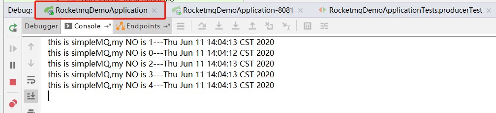
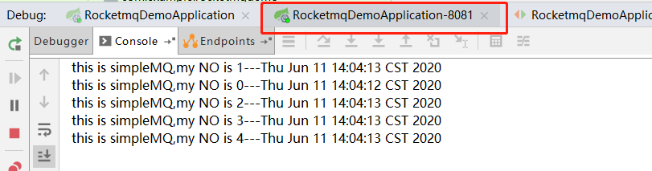

# RocketMQ系列（五）广播与延迟消息

今天要给大家介绍RocketMQ中的两个功能，一个是“广播”，这个功能是比较基础的，几乎所有的mq产品都是支持这个功能的；另外一个是“延迟消费”，这个应该算是RocketMQ的特色功能之一了吧。接下来，我们就分别看一下这两个功能。

## 广播

广播是把消息发送给订阅了这个主题的所有消费者。这个定义很清楚，但是这里边的知识点你都掌握了吗？咱们接着说“广播”的机会，把消费者这端的内容好好和大家说说。

* 首先，消费者端的概念中，最大的应该是消费者组，一个消费者组中可以有多个消费者，这些消费者必须订阅同一个Topic。
* 那么什么算是一个消费者呢？我们在写消费端程序时，看到了setConsumeThreadMax这个方法，设置消费者的线程数，难道一个线程就是一个消费者？错！这里的一个消费者是一个进程，你可以理解为ip+端口。如果在同一个应用中，你实例化了两个消费者，这两个消费者配置了相同的消费者组名称，那么应用程序启动时会报错的，这里不给大家演示了，感兴趣的小伙伴私下里试一下吧。
* 同一个消息，可以被不同的消费者组同时消费。假设，我有两个消费者组cg-1和cg-2，这两个消费者组订阅了同一个Topic，那么这个Topic的消息会被cg-1和cg-2同时消费。那这是不是广播呢？错！当然不是广播，广播是同一个消费者组中的多个消费者都消费这个消息。如果配置的不是广播，像前几个章节中的那样，一个消息只能被一个消费者组消费一次。

好了，说了这么多，我们实验一下吧，先把消费者配置成广播，如下：

```java
@Bean(name = "broadcast", initMethod = "start",destroyMethod = "shutdown")
public DefaultMQPushConsumer broadcast() throws MQClientException {
    DefaultMQPushConsumer consumer = new DefaultMQPushConsumer("broadcast");
    consumer.setNamesrvAddr("192.168.73.130:9876;192.168.73.131:9876;192.168.73.132:9876;");
    consumer.subscribe("cluster-topic","*");
    consumer.setMessageModel(MessageModel.BROADCASTING);
    consumer.registerMessageListener((MessageListenerConcurrently) (msgs, context) -> {
        for (MessageExt msg : msgs) {
            System.out.println(new String(msg.getBody()));
        }
        return ConsumeConcurrentlyStatus.CONSUME_SUCCESS;
    });
    return consumer;
}

```

* 其中，NameServer，订阅的Topic都没有变化。
* 注意其中`consumer.setMessageModel(MessageModel.BROADCASTING);`这段代码，设置消费者为广播。咱们可以看一下，`MessageModel`枚举中只有两个值，`BROADCASTING`和`CLUSTERING`，默认为`CLUSTERING`。

因为要测试广播，所以我们要启动多个消费者，还记得什么是消费者吗？对了，一个ip+端口算是一个消费者，在这里我们启动两个应用，端口分别是8080和8081。发送端的程序不变，如下：

```java
@Test
public void producerTest() throws Exception {

    for (int i = 0;i<5;i++) {
        MessageExt message = new MessageExt();
        message.setTopic("cluster-topic");
        message.setKeys("key-"+i);
        message.setBody(("this is simpleMQ,my NO is "+i+"---"+new Date()).getBytes());
        SendResult sendResult = defaultMQProducer.send(message);
        System.out.println("i=" + i);
        System.out.println("BrokerName:" + sendResult.getMessageQueue().getBrokerName());
    }
}
```

我们执行一下发送端的程序，日志如下：

```shell
i=0
BrokerName:broker-a
i=1
BrokerName:broker-a
i=2
BrokerName:broker-b
i=3
BrokerName:broker-b
i=4
BrokerName:broker-b
```

再来看看8080端口的应用后台打印出来的日志：



消费了5个消息，再看看8081的后台打印的日志，



也消费了5个。两个消费者同时消费了消息，这就是广播。有的小伙伴可能会有疑问了，如果不设置广播，会怎么样呢？私下里实验一下吧，上面的程序中，只要把设置广播的那段代码注释掉就可以了。运行的结果当然是只有一个消费者可以消费消息。

## 延迟消息

延迟消息是指消费者过了一个指定的时间后，才去消费这个消息。大家想象一个电商中场景，一个订单超过30分钟未支付，将自动取消。这个功能怎么实现呢？一般情况下，都是写一个定时任务，一分钟扫描一下超过30分钟未支付的订单，如果有则被取消。这种方式由于每分钟查询一下订单，一是时间不精确，二是查库效率比较低。这个场景使用RocketMQ的延迟消息最合适不过了，我们看看怎么发送延迟消息吧，发送端代码如下：

```java
@Test
public void producerTest() throws Exception {

    for (int i = 0;i<1;i++) {
        MessageExt message = new MessageExt();
        message.setTopic("cluster-topic");
        message.setKeys("key-"+i);
        message.setBody(("this is simpleMQ,my NO is "+i+"---"+new Date()).getBytes());
        message.setDelayTimeLevel(2);
        SendResult sendResult = defaultMQProducer.send(message);
        System.out.println("i=" + i);
        System.out.println("BrokerName:" + sendResult.getMessageQueue().getBrokerName());
    }
}
```

* 我们只是增加了一句`message.setDelayTimeLevel(2);`
* 为了方便，这次我们只发送一个消息。

setDelayTimeLevel是什么意思，设置的是2，难道是2s后消费吗？怎么参数也没有时间单位呢？如果我要自定义延迟时间怎么办？我相信很多小伙伴都有这样的疑问，我也是带着这样的疑问查了很多资料，最后在RocketMQ的Github官网上看到了说明，

* 在RocketMQ的源码中，有一个MessageStoreConfig类，这个类中定义了延迟的时间，我们看一下，

```java
// org/apache/rocketmq/store/config/MessageStoreConfig.java
private String messageDelayLevel = "1s 5s 10s 30s 1m 2m 3m 4m 5m 6m 7m 8m 9m 10m 20m 30m 1h 2h";
```

* 我们在程序中设置的是2，那么这个消息将在5s以后被消费。
* 目前RocketMQ还不支持自定义延迟时间，延迟时间只能从上面的时间中选。如果你非要定义一个时间怎么办呢？RocketMQ是开源的，下载代码，把上面的时间改一下，再打包部署，就OK了。

再看看消费端的代码，

```java
@Bean(name = "broadcast", initMethod = "start",destroyMethod = "shutdown")
public DefaultMQPushConsumer broadcast() throws MQClientException {
    DefaultMQPushConsumer consumer = new DefaultMQPushConsumer("broadcast");
    consumer.setNamesrvAddr("192.168.73.130:9876;192.168.73.131:9876;192.168.73.132:9876;");
    consumer.subscribe("cluster-topic","*");
    consumer.setMessageModel(MessageModel.BROADCASTING);
    consumer.registerMessageListener((MessageListenerConcurrently) (msgs, context) -> {
        for (MessageExt msg : msgs) {
            Date now = new Date();
            System.out.println("消费时间："+now);

            Date msgTime = new Date();
            msgTime.setTime(msg.getBornTimestamp());
            System.out.println("消息生成时间："+msgTime);

            System.out.println(new String(msg.getBody()));
        }
        return ConsumeConcurrentlyStatus.CONSUME_SUCCESS;
    });
    return consumer;
}
```

* 我们还是使用广播的模式，没有变。
* 打印出了当前的时间，这个时间就是消费的时间。
* 通过msg.getBornTimestamp()方法，获得了消息的生成时间，也打印出来，看看是不是延迟5s。

启动两个消费者8080和8081，发送消息，再看看消费者的后台日志，

```shell
消费时间：Thu Jun 11 14:45:53 CST 2020
消息生成时间：Thu Jun 11 14:45:48 CST 2020
this is simpleMQ,my NO is 0---Thu Jun 11 14:45:47 CST 2020
```

我们看到消费时间比生成时间晚5s，符合我们的预期。这个功能还是比较实用的，如果能够自定义延迟时间就更好了。

## 总结

RocketMQ的这两个知识点还是比较简单的，大家要分清楚什么是消费者组，什么是消费者，什么是消费者线程。另外就是延迟消息是不支持自定义的，大家可以在Github上看一下源码。好了~今天就到这里了。

