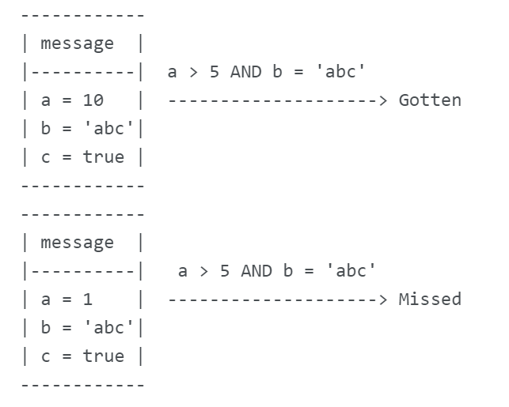

# RocketMQ系列（六）批量发送与过滤

今天我们再来看看RocketMQ的另外两个小功能，消息的批量发送和过滤。这两个小功能提升了我们使用RocketMQ的效率。

## 批量发送

以前我们发送消息的时候，都是一个一个的发送，这样效率比较低下。能不能一次发送多个消息呢？当然是可以的，RocketMQ为我们提供了这样的功能。但是它也有一些使用的条件：

* 同一批发送的消息的Topic必须相同；
* 同一批消息的waitStoreMsgOK 必须相同；
* 批量发送的消息不支持延迟，就是上一节说的延迟消息；
* 同一批次的消息，大小不能超过1MiB；

好了，只要我们满足上面的这些限制，就可以使用批量发送了，我们来看看发送端的代码吧，

```java
@Test
public void producerBatch() throws Exception {

    List<Message> messages = new ArrayList<>();
    for (int i = 0;i<3;i++) {
        MessageExt message = new MessageExt();
        message.setTopic("cluster-topic");
        message.setKeys("key-"+i);
        message.setBody(("this is batchMQ,my NO is "+i+"---"+new Date()).getBytes());
        messages.add(message);
    }
    SendResult sendResult = defaultMQProducer.send(messages);
    System.out.println("sendResult:" + sendResult.getSendStatus().toString());
}
```

* 其实批量发送很简单，我们只是把消息放到一个List当中，然后统一的调用send方法发送就可以了。

再来看看消费端的代码，

```java
@Bean(initMethod = "start",destroyMethod = "shutdown")
public DefaultMQPushConsumer pushConsumer()  {
    try {
        DefaultMQPushConsumer consumer = new DefaultMQPushConsumer("DefaultMQPushConsumer");
        consumer.setNamesrvAddr("192.168.73.130:9876;192.168.73.131:9876;192.168.73.132:9876;");
        consumer.subscribe("cluster-topic", "*");
        consumer.registerMessageListener(new MessageListenerConcurrently() {
            @Override
            public ConsumeConcurrentlyStatus consumeMessage(List<MessageExt> msgs, ConsumeConcurrentlyContext context) {
                System.out.println("msgs.size():"+msgs.size());
                if (msgs != null && msgs.size() > 0) {
                    for (MessageExt msg : msgs) {
                        System.out.println(new String(msg.getBody()));
                    }
                }
                return ConsumeConcurrentlyStatus.CONSUME_SUCCESS;
            }
        });
        return consumer;
    }catch (Exception e) {
        e.printStackTrace();
    }
    return null;
}
```

* 消费端的代码没有任何的变化，正常的接收消息就可以了，我们只是打印出了msgs.size()，看看一次接收一个消息，还是一次可以批量的接收多个消息。

我们启动项目，批量发送一下，看看效果吧，

发送端的日志如下：

```shell
sendResult:SEND_OK
```

发送成功，看来我们批量发送的3个消息都进入到了队列中，再看看消费端，是一次消费一个，还是一次消费3个，如下：

```shell
msgs.size():1
this is batchMQ,my NO is 0---Mon Jun 15 09:31:04 CST 2020
msgs.size():1
this is batchMQ,my NO is 1---Mon Jun 15 09:31:04 CST 2020
msgs.size():1
this is batchMQ,my NO is 2---Mon Jun 15 09:31:04 CST 2020
```

看样子是一次只消费了一个消息，那么能不能一次消费3个消息呢？当然是可以的，不过要进行特殊的设置，

```java
consumer.setConsumeMessageBatchMaxSize(5);
```

在消费端，我们设置批量消费消息的数量是5，这个值默认是1。我们再看看消费端的日志，

```shell
msgs.size():3
this is batchMQ,my NO is 0---Mon Jun 15 09:35:47 CST 2020
this is batchMQ,my NO is 1---Mon Jun 15 09:35:47 CST 2020
this is batchMQ,my NO is 2---Mon Jun 15 09:35:47 CST 2020
```

这次一次消费了3个消息，如果消息比较多的话，最大一次能消费5个。这就是RocketMQ的批量发送和批量消费。

## 消息过滤

其实我们在大多数情况下，使用tag标签就能够很好的实现消息过滤。虽然tag标签咱们并没有过多的介绍，其实也很好理解，就是一个子Topic的概念，咱们在构建消息message的时候，`message.setTags("xxx")`。然后在消费的时候，订阅Topic的时候，也可以指定订阅的tag，

```java
consumer.subscribe("cluster-topic", "*");
```

看到那个"\*"了吗？它就是订阅的tag，"\*"代表全部的tag，如果您想订阅其中的一个或几个，可以使用这种方式"tagA || tagB || tagC"，这是订阅了cluster-topic下的3个tag，其他的tag是不会被消费的。

这里我们所说的消息过滤比tag要高级很多，是可以支持sql的，怎么样？高级吧。比如：我们订阅"a > 5 and b = \'abc\'"的消息，如下图：



但是，RocketMQ毕竟不是数据库，它只能支持一些基础的SQL语句，并不是所有的SQL都支持，

* 数字型的支持，`>`, `>=`, `<`, `<=`, `BETWEEN`, `=`

* 字符串支持，=`, `<>`, `IN
* `IS NULL`或者`IS NOT NULL`
* 逻辑判断，`AND`，`OR`，`NOT`；

字段的类型也只是简单的几种，

* 数字型，支持123，543.123，整型、浮点都可以；
* 字符串，必须使用单引号''括起来；
* 空值，NULL；
* 布尔型，TRUE或者FALSE；

并且对消费者的类型也有一定的限制，只能使用push consumer才可以进行消息过滤。好了，说了这么多了，我们看看怎么使用吧，消费端和生产端都要进行相应的改造，先看看生产端吧，

```java
@Test
public void producerBatch() throws Exception {

    List<Message> messages = new ArrayList<>();
    for (int i = 0;i<3;i++) {
        MessageExt message = new MessageExt();
        message.setTopic("cluster-topic");
        message.setKeys("key-"+i);
        message.setBody(("this is batchMQ,my NO is "+i+"---"+new Date()).getBytes());

        int a = i+4;
        message.putUserProperty("a",String.valueOf(a));

        messages.add(message);
    }
    SendResult sendResult = defaultMQProducer.send(messages);
    System.out.println("sendResult:" + sendResult.getSendStatus().toString());
}
```

我们在之前批量发送的基础上进行了修改，定义了a的值，等于i+4，这样循环3次，a的值就是4，5，6。然后调用`message.putUserProperty("a",String.valueOf(a))`，**注意，在使用消息过滤的时候，这些附加的条件属性都是通过putUserProperty方法进行设置。**这里，我们设置了a的值。再看看消费端，

```java
consumer.subscribe("cluster-topic", MessageSelector.bySql("a > 5"));
```

消费端，整体上没有变化，只是在订阅的方法中，使用`MessageSelector.bySql("a > 5")`，进行了条件的过滤。有的小伙伴可能会有疑问，我既想用sql过滤又想用tag过滤怎么办？当然也是可以，我们可以使用`MessageSelector.bySql("a > 5").byTag("xx)`，byTag和bySql不分前后，怎么样，很强大吧。我们运行一下程序，看看效果吧。

我们启动一下服务，**报错了，怎么回事？错误信息如下：**

```shell
The broker does not support consumer to filter message by SQL92
```

队列不支持过滤消息，我们查询了RocketMQ源码中的BrokerConfig类，这个类就是对broker的一些设置，其中发现了这两个属性，

```java
// whether do filter when retry.
private boolean filterSupportRetry = false;
private boolean enablePropertyFilter = false;
```

* filterSupportRetry是在重试的时候，是否支持filter；
* enablePropertyFilter，这个就是是否支持过滤消息的属性；

我们把这两个属性在broker的配置文件改为true吧，如下：

```shell
filterSupportRetry=true
enablePropertyFilter=true
```

然后，再重新部署一下我们两主两从的集群环境。环境部署完以后，我们再重启应用，没有报错。在生产端发送一下消息看看吧，

```shell
sendResult:SEND_OK
```

生产端发送消息没有问题，说明3个消息都发送成功了。再看看消费端的日志，

```shell
msgs.size():1
this is batchMQ,my NO is 2---Mon Jun 15 10:59:37 CST 2020
```

只消费了一个消息，并且这个消息中i的值是2，那么a的值就是2+4=6，它是>5的，满足SQL的条件，所以被消费掉了。这完全符合我们的预期。

## 总结

今天的两个小功能还是比较有意思的，但里边也有需要注意的地方，

* 消息的批量发送，只要我们满足它的条件，然后使用List发送就可以了；批量消费，默认的消费个数是1，我们可以调整它的值，这样就可以一次消费多个消息了；
* 过滤消息中，最大的坑就是队列的配置里，需要设置enablePropertyFilter=true，否则消费端在启动的时候报不支持SQL的错误；

我们在使用的时候，多加留意就可以了，有问题，评论区留言吧~


