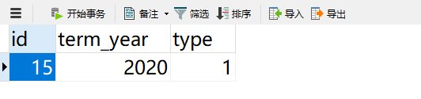
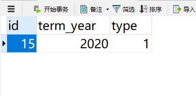
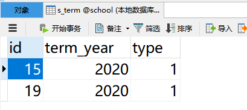

# RocketMQ系列（七）事务消息

终于到了今天了，终于要讲RocketMQ最牛X的功能了，那就是**事务消息**。为什么事务消息被吹的比较热呢？近几年微服务大行其道，整个系统被切成了多个服务，每个服务掌管着一个数据库。那么多个数据库之间的数据一致性就成了问题，虽然有像XA这种强一致性事务的支持，但是这种强一致性在互联网的应用中并不适合，人们还是更倾向于使用最终一致性的解决方案，在最终一致性的解决方案中，使用MQ保证各个系统之间的数据一致性又是首选。

RocketMQ为我们提供了事务消息的功能，它使得我们投放消息和其他的一些操作保持一个整体的原子性。比如：向数据库中插入数据，再向MQ中投放消息，把这两个动作作为一个原子性的操作。貌似其他的MQ是没有这种功能的。

但是，纵观全网，讲RocketMQ事务消息的博文中，几乎没有结合数据库的，都是直接投放消息，然后讲解事务消息的几个状态，虽然讲的也没毛病，但是和项目中事务最终一致性的落地方案还相距甚远。包括我自己在内，在项目中，服务化以后，用MQ保证事务的最终一致性，在网上一搜，根本没有落地的方案，都是侃侃而谈。于是，我写下这篇博文，结合数据库，来谈一谈RocketMQ的事务消息到底怎么用。

## 基础概念

要使用RocketMQ的事务消息，要实现一个TransactionListener的接口，这个接口中有两个方法，如下：

```java
/**
     * When send transactional prepare(half) message succeed, this method will be invoked to execute local transaction.
     *
     * @param msg Half(prepare) message
     * @param arg Custom business parameter
     * @return Transaction state
     */
LocalTransactionState executeLocalTransaction(final Message msg, final Object arg);

/**
     * When no response to prepare(half) message. broker will send check message to check the transaction status, and this
     * method will be invoked to get local transaction status.
     *
     * @param msg Check message
     * @return Transaction state
     */
LocalTransactionState checkLocalTransaction(final MessageExt msg);
```

RocketMQ的事务消息是基于两阶段提交实现的，也就是说消息有两个状态，prepared和commited。当消息执行完send方法后，进入的prepared状态，进入prepared状态以后，就要执行executeLocalTransaction方法，这个方法的返回值有3个，也决定着这个消息的命运，

* COMMIT_MESSAGE：提交消息，这个消息由prepared状态进入到commited状态，消费者可以消费这个消息；
* ROLLBACK_MESSAGE：回滚，这个消息将被删除，消费者不能消费这个消息；
* UNKNOW：未知，这个状态有点意思，如果返回这个状态，这个消息既不提交，也不回滚，还是保持prepared状态，而最终决定这个消息命运的，是checkLocalTransaction这个方法。

当executeLocalTransaction方法返回UNKNOW以后，RocketMQ会每隔一段时间调用一次checkLocalTransaction，这个方法的返回值决定着这个消息的最终归宿。那么checkLocalTransaction这个方法多长时间调用一次呢？我们在BrokerConfig类中可以找到，

```java
 /**
  * Transaction message check interval.
  */
@ImportantField
private long transactionCheckInterval = 60 * 1000;
```

这个值是在brokder.conf中配置的，默认值是60*1000，也就是1分钟。那么会检查多少次呢？如果每次都返回UNKNOW，也不能无休止的检查吧，

```java
/**
 * The maximum number of times the message was checked, if exceed this value, this message will be discarded.
 */
@ImportantField
private int transactionCheckMax = 5;
```

这个是检查的最大次数，超过这个次数，如果还返回UNKNOW，这个消息将被删除。

事务消息中，TransactionListener这个最核心的概念介绍完后，我们看看代码如何写吧。

## 落地案例

我们在数据库中有一张表，具体如下：

```sql
CREATE TABLE `s_term` (
  `id` int(11) NOT NULL AUTO_INCREMENT,
  `term_year` year(4) NOT NULL ,
  `type` int(1) NOT NULL DEFAULT '1' ,
  PRIMARY KEY (`id`)
) 
```

字段的具体含义大家不用管，一会我们将向这张表中插入一条数据，并且向MQ中投放消息，这两个动作是一个原子性的操作，要么全成功，要么全失败。

我们先来看看事务消息的客户端的配置，如下：

```java
@Bean(name = "transactionProducer",initMethod = "start",destroyMethod = "shutdown")
public TransactionMQProducer transactionProducer() {
    TransactionMQProducer producer = new
        TransactionMQProducer("TransactionMQProducer");
    producer.setNamesrvAddr("192.168.73.130:9876;192.168.73.131:9876;192.168.73.132:9876;");
    producer.setTransactionListener(transactionListener());
    return producer;
}

@Bean
public TransactionListener transactionListener() {
    return new TransactionListenerImpl();
}
```

我们使用TransactionMQProducer生命生产者的客户端，并且生产者组的名字叫做TransactionMQProducer，后面NameServer的地址没有变化。最后就是设置了一个TransactionListener监听器，这个监听器的实现我们也定义了一个Bean，返回的是我们自定义的TransactionListenerImpl，我们看看里边怎么写的吧。

```java
public class TransactionListenerImpl implements TransactionListener {
    @Autowired
    private TermMapper termMapper;

    @Override
    public LocalTransactionState executeLocalTransaction(Message msg, Object arg) {

        Integer termId = (Integer)arg;
        Term term = termMapper.selectById(termId);
        System.out.println("executeLocalTransaction termId="+termId+" term:"+term);
        if (term != null) return COMMIT_MESSAGE;

        return LocalTransactionState.UNKNOW;
    }

	@Override
    public LocalTransactionState checkLocalTransaction(MessageExt msg) {
        String termId = msg.getKeys();
        Term term = termMapper.selectById(Integer.parseInt(termId));
        System.out.println("checkLocalTransaction termId="+termId+" term:"+term);
        if (term != null) {
            System.out.println("checkLocalTransaction：COMMIT_MESSAGE");
            return COMMIT_MESSAGE;
        }
        System.out.println("checkLocalTransaction：ROLLBACK_MESSAGE");
        return ROLLBACK_MESSAGE;
    }
}
```

在这个类中，我们要实现executeLocalTransaction和checkLocalTransaction两个方法，其中executeLocalTransaction是在执行完send方法后立刻执行的，里边我们根据term表的id去查询，如果能够查询出结果，就commit，消费端可以消费这个消息，如果查询不到，就返回一个UNKNOW，说明过一会会调用checkLocalTransaction再次检查。在checkLocalTransaction方法中，我们同样用termId去查询，这次如果再查询不到就直接回滚了。

好了，事务消息中最重要的两个方法都已经实现了，我们再来看看service怎么写吧，

```java
@Autowired
private TermMapper termMapper;
@Autowired
@Qualifier("transactionProducer")
private TransactionMQProducer producer;

@Transactional(rollbackFor = Exception.class)
public void sendTransactionMQ() throws Exception {
    Term term = new Term();
    term.setTermYear(2020);
    term.setType(1);
    int insert = termMapper.insert(term);

    Message message = new Message();
    message.setTopic("cluster-topic");
    message.setKeys(term.getId()+"");
    message.setBody(new String("this is transaction mq "+new Date()).getBytes());

    TransactionSendResult sendResult = producer
        .sendMessageInTransaction(message, term.getId());
    System.out.println("sendResult:"+sendResult.getLocalTransactionState() 
                       +" 时间："+new Date());
}
```

* 在sendTransactionMQ方法上，我们使用了@Transactional注解，那么在这个方法中，发生任何的异常，数据库事务都会回滚；
* 然后，我们创建Term对象，向数据库中插入Term；
* 构建Mesaage的信息，将termId作为message的key；
* 使用sendMessageInTransaction发送消息，传入message和termId，**这两个参数和executeLocalTransaction方法的入参是对应的。**

最后，我们在test方法中，调用sendTransactionMQ方法，如下：

```java
@Test
public void sendTransactionMQ() throws InterruptedException {
    try {
        transactionService.sendTransactionMQ();
    } catch (Exception e) {
        e.printStackTrace();
    }

    Thread.sleep(600000);
}
```

整个生产端的代码就是这些了，消费端的代码没有什么变化，就不给大家贴出来了。接下来，我们把消费端的应用启动起来，**消费端的应用最好不要包含生产端的代码，因为TransactionListener实例化以后，就会进行监听，而我们在消费者端是不希望看到TransactionListener中的日志的。**

我们运行一下生产端的代码，看看是什么情况，日志如下：

```shell
executeLocalTransaction termId=15 term:com.example.rocketmqdemo.entity.Term@4a3509b0
sendResult:COMMIT_MESSAGE 时间：Wed Jun 17 08:56:49 CST 2020
```

* 我们看到，先执行的是executeLocalTransaction这个方法，termId打印出来了，发送的结果也出来了，是COMMIT_MESSAGE，那么消费端是可以消费这个消息的；
* 注意一下两个日志的顺序，先执行的executeLocalTransaction，说明在执行sendMessageInTransaction时，就会调用监听器中的executeLocalTransaction，它的返回值决定着这个消息是否真正的投放到队列中；

再看看消费端的日志，

```shell
msgs.size():1
this is transaction mq Wed Jun 17 08:56:49 CST 2020
```

消息被正常消费，没有问题。那么数据库中有没有termId=15的数据呢？我们看看吧，



数据是有的，插入数据也是成功的。

**这样使用就真的正确的吗？我们改一下代码看看，在service方法中抛个异常，让数据库的事务回滚，看看是什么效果。**改动代码如下：

```java
@Transactional(rollbackFor = Exception.class)
public void sendTransactionMQ() throws Exception {
    ……
    throw new Exception("数据库事务异常");
}
```

抛出异常后，数据库的事务会回滚，那么MQ呢？我们再发送一个消息看看，

生产端的日志如下：

```shell
executeLocalTransaction termId=16 term:com.example.rocketmqdemo.entity.Term@5d6b5d3d
sendResult:COMMIT_MESSAGE 时间：Wed Jun 17 09:07:15 CST 2020

java.lang.Exception: 数据库事务异常
```

* 从日志中，我们可以看到，消息是投放成功的，termId=16，事务的返回状态是COMMIT_MESSAGE；
* 最后抛出了我们定义的异常，那么数据库中应该是不存在这条消息的啊；

我们先看看数据库吧，



数据库中并没有termId=16的数据，**那么数据库的事务是回滚了，而消息是投放成功的，并没有保持原子性啊**。那么为什么在执行executeLocalTransaction方法时，能够查询到termId=16的数据呢？**还记得MySQL的事务隔离级别吗？忘了的赶快复习一下吧。**在事务提交前，我们是可以查询到termId=16的数据的，所以消息提交了，看看消费端的情况，

```shell
msgs.size():1
this is transaction mq Wed Jun 17 09:07:15 CST 2020
```

消息也正常消费了，这明显不符合我们的要求，我们如果在微服务之间使用这种方式保证数据的最终一致性，肯定会有大麻烦的。那我们该怎么使用s呢？我们可以在executeLocalTransaction方法中，固定返回UNKNOW，数据插入数据库成功也好，失败也罢，我们都返回UNKNOW。那么这个消息是否投放到队列中，就由checkLocalTransaction决定了。checkLocalTransaction肯定在sendTransactionMQ后执行，而且和sendTransactionMQ不在同一事务中。我们改一下程序吧，

```java
@Override
public LocalTransactionState executeLocalTransaction(Message msg, Object arg) {
    return LocalTransactionState.UNKNOW;
}
```

其他的地方不用改，我们再发送一下消息，

```shell
sendResult:UNKNOW 时间：Wed Jun 17 09:56:59 CST 2020
java.lang.Exception: 数据库事务异常

checkLocalTransaction termId=18 term:null
checkLocalTransaction：ROLLBACK_MESSAGE
```

* 事务消息发送的结果是UNKNOW，然后抛出异常，事务回滚；
* checkLocalTransaction方法，查询termId=18的数据，为null，消息再回滚；

又看了一下消费端，没有日志。数据库中也没有termId=18的数据，这才符合我们的预期，数据库插入不成功，消息投放不成功。我们再把抛出异常的代码注释掉，看看能不能都成功。

```java
@Transactional(rollbackFor = Exception.class)
public void sendTransactionMQ() throws Exception {
    ……
    //throw new Exception("数据库事务异常");
}
```

再执行一下发送端程序，日志如下：

```shell
sendResult:UNKNOW 时间：Wed Jun 17 10:02:57 CST 2020
checkLocalTransaction termId=19 term:com.example.rocketmqdemo.entity.Term@3b643475
checkLocalTransaction：COMMIT_MESSAGE
```

* 发送结果返回UNKNOW；
* checkLocalTransaction方法查询termId=19的数据，能够查到；
* 返回COMMIT_MESSAGE，消息提交到队列中；

先看看数据库中的数据吧，



termId=19的数据入库成功了，再看看消费端的日志，

```shell
msgs.size():1
this is transaction mq Wed Jun 17 10:02:56 CST 2020
```

消费成功，这才符合我们的预期。数据插入数据库成功，消息投放队列成功，消费消息成功。

## 总结

事务消息最重要的就是TransactionListener接口的实现，我们要理解executeLocalTransaction和checkLocalTransaction这两个方法是干什么用的，以及它们的执行时间。再一个就是和数据库事务的结合，数据库事务的隔离级别大家要知道。把上面这几点掌握了，就可以灵活的使用RocketMQ的事务消息了。