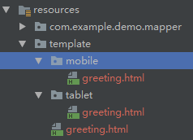

今天闲来无事，浏览Spring的官方网站，发现了Spring Mobile项目，之前也看到过，还以为是针对手机端的项目，并没有细看。今天仔细看了一下，原来是可以探测请求端的设备和系统。比如是手机、平板、还是正常的PC网站。它是Spring MVC的扩展，主要的目的是简化手机web应用的开发。

它的主要特点是：

* 在服务端探测发起请求的设备，手机或平板等。
* 管理站点，统计每个用户的偏好。
* 根据请求设备的不同，返回适合该设备的视图

具体的在项目中使用也非常的简单，例如我们使用Spring Boot搭建项目，然后引入Spring Mobile的starter，如下：
```xml
<dependency>
    <groupId>org.springframework.boot</groupId>
    <artifactId>spring-boot-starter-mobile</artifactId>
</dependency>
```
然后在application.properties文件中将sitepreference打开，如下：
```properties
spring.mobile.sitepreference.enabled=true
```
Spring Boot自动注入了3个类，DeviceResolverHandlerInterceptor，SitePreferenceHandlerInterceptor和SitePreferenceMethodArgumentResolver。DeviceResolverHandlerInterceptor是HandlerInterceptor的一个实现，从名字来看，它拦截到应用的请求，判断发送请求设备的类型。当设备解决以后，SitePreferenceMethodArgumentResolver允许SpringMVC在Controller中使用SitePreference实体。在内部，DeviceResolverHandlerInterceptor判断请求头中的User-Agent，基于请求头中的值，判断请求是否来自浏览器（桌面）、手机、还是Pad。

SitePreferenceHandlerInterceptor利用探测到的设备，判断用户的初始站点偏好。如果用户喜欢另一个站点，则选择该站点，并在随后的请求中使用，以覆盖已解析的设备值。站点偏好是通过请求中特殊的查询字符串设置的。一旦接收到，偏好将被持久化到cookie中，以供将来参考。站点偏好功能在Spring Boot中默认是打开的，可以通过上面的设置关闭它。

这样我们就可以使用Spring Mobile了，我们在Controller中加了如下代码：
```java
@RequestMapping("index")
public String index(HttpSession session,Page<User> page,SitePreference site,Device device){
    System.out.println("site.isMobile:"+site.isMobile());
    System.out.println("site.isTablet:"+site.isTablet());
    System.out.println("site.isNormal:"+site.isNormal());

    System.out.println("device.isMobile:"+device.isMobile());
    System.out.println("device.isTablet:"+device.isTablet());
    System.out.println("device.isNormal:"+device.isNormal());

    System.out.println("device.Platform:"+device.getDevicePlatform());
    System.out.println("site.name:"+site.name());
    System.out.println(session.getId());
    return null;
}
```
运行后，后台打印出的值如下：
```
site.isMobile:true
site.isTablet:false
site.isNormal:false
device.isMobile:true
device.isTablet:false
device.isNormal:false
device.Platform:ANDROID
site.name:MOBILE
```
测试时，我们可以通过浏览器的调试功能（F12），模拟不同的设备。这样我们就可以捕获到前端的设备类型了。

我们在开发时，可能针对不同的设备做不同的适配页面。Spring Mobile也为我们提供了非常强大的视图代理解析功能。我们只需要在applicaton.properties中配置即可。
```properties
spring.mobile.devicedelegatingviewresolver.enabled=true
spring.mobile.devicedelegatingviewresolver.mobile-prefix=
spring.mobile.devicedelegatingviewresolver.mobile-suffix=
spring.mobile.devicedelegatingviewresolver.tablet-prefix=
spring.mobile.devicedelegatingviewresolver.tablet-suffix=
spring.mobile.devicedelegatingviewresolver.normal-prefix=
spring.mobile.devicedelegatingviewresolver.normal-suffix=
```
我们将代理解析器打开，并配置3中设备类型的前缀和后缀。后6项也可以不配置，默认的3中类型的后缀都没有，前缀手机类型的是/mobile，平板类型的是/tablet。浏览器是没有前缀的，然后将3中视图放在相应的目录中，代码如下：

```java
@Controller
public class GreetingController {
 
    @RequestMapping("/greeting")
    public String greeting() {
        return "greeting";
    }
 
}
```
页面如下



这样，3个不同的设备就会访问不同的页面，很方便吧。示例代码在我的GitHub中，https://github.com/liubo-tech/spring-boot-demo。欢迎大家在评论区讨论。

