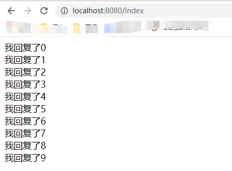

# Spring整合WebSocket

WebSocket，干什么用的？我们有了HTTP，为什么还要用WebSocket？很多同学都会有这样的疑问。我们先来看一个场景，大家的手机里都有微信，在微信中，只要有新的消息，这个联系人的前面就会有一个红点，这个需求要怎么实现呢？大家思考3秒钟。哈哈，最简单，最笨的方法就行客户端轮询，在微信的客户端每隔一段时间（比如：1s或者2s），向服务端发送一个请求，查询是否有新的消息，如果有消息就显示红点。这种方法是不是太笨了呢？每次都要客户端去发起请求，难道就不能从服务端发起请求吗？这样客户端不就省事了吗。再看看股票软件，每个股票的当前价格都是实时的，这我们怎么做，每个一秒请求后台查询当前股票的价格吗？这样效率也太低了吧，而且时效性也很低。这就需要我们今天的主角WebSocket去实现了。

## 什么是WebSocket

WebSocket协议，[RFC 6455](https://tools.ietf.org/html/rfc6455)这个大家有兴趣可以看看，太深，太底层。它是通过一个TCP连接，在客服端与服务端之间建立的一个全双工、双向的通信渠道。它是一个不同于HTTP的TCP协议，但是它通过HTTP工作。它的默认端口也是80和443，和HTTP是一样的。

一个WebSocket的交互开始于一个HTTP请求，这是一个握手请求，这个请求中包含一个Upgrade请求头，具体如下：

```shell
GET /spring-websocket-portfolio/portfolio HTTP/1.1
Host: localhost:8080
Upgrade: websocket 
Connection: Upgrade 
Sec-WebSocket-Key: Uc9l9TMkWGbHFD2qnFHltg==
Sec-WebSocket-Protocol: v10.stomp, v11.stomp
Sec-WebSocket-Version: 13
Origin: http://localhost:8080
```

我们看到的第3行和第4行就是这个特殊的请求头，既然包含了这个特殊的请求头，那么请求就要升级，升级成WebSocket请求。这个握手请求的响应也比较特殊，它的成功状态码是101，而不是HTTP的200，如下：

```shell
HTTP/1.1 101 Switching Protocols 
Upgrade: websocket
Connection: Upgrade
Sec-WebSocket-Accept: 1qVdfYHU9hPOl4JYYNXF623Gzn0=
Sec-WebSocket-Protocol: v10.stomp
```

在这次成功的握手请求以后，在客户端和服务端之间的socket被打开，客户端和服务端可以进行消息的发送和接收。

## 程序实现

我们还是使用现在流程的SpringBoot去搭建我们的项目，在项目中，我们添加两个依赖，如下：

```xml
<dependency>
    <groupId>org.springframework.boot</groupId>
    <artifactId>spring-boot-starter-websocket</artifactId>
</dependency>

<dependency>
    <groupId>org.springframework.boot</groupId>
    <artifactId>spring-boot-starter-thymeleaf</artifactId>
</dependency>
```

* spring-boot-starter-websocket，这是我们今天的主角，我们WebSocket的实现都依赖于这个jar包；
* spring-boot-starter-thymeleaf，这只是起个辅助作用，在项目中要写个页面；

好了，基础工作准备好了，下面进入最核心的代码，先写个WebSocketHandler，这个是用于在服务端接收和返回消息使用的。如下：

```java
public class MyHandler extends TextWebSocketHandler {

    @Override
    protected void handleTextMessage(WebSocketSession session, 
                                     TextMessage message) throws Exception {
        String payload = message.getPayload();
        System.out.println("我接收到的消息："+payload);

        String rtnMsg = "我回复了";

        for (int i=0;i<10;i++) {
            Thread.sleep(2000);
            session.sendMessage(new TextMessage(rtnMsg+i));
        }
        super.handleTextMessage(session, message);
    }
}
```

* 我们创建一个MyHandler类，继承TextWebSocketHandler类，这个类主要是处理文本的，当然也可以继承其他的类，比如：处理二进制的BinaryWebSocketHandler；
* 然后，我们实现handleTextMessage方法，这个方法有两个参数，WebSocketSession和TextMessage，TextMessage是接收客户端发来的消息。WebSocketSession用于设置WebSocket会话和向客户端发送消息；
* 在具体的方法实现中，我们调用TextMessage的getPayload方法，可以取出客户端发送的消息；
* 最后我们通过WebSocketSession的sendMessage方法向客户端发送消息，这里进行10次循环，每次循环我们间隔2秒；

好了，到这里最核心的处理接收消息的方法，我们已经写好了，然后我们将这个handler指定一个URL，如下：

```java
@Configuration
@EnableWebSocket
public class WebSocketConfig implements WebSocketConfigurer {
    @Override
    public void registerWebSocketHandlers(WebSocketHandlerRegistry registry) {
        registry.addHandler(myHandler(),"/websocket");
    }

    @Bean
    public MyHandler myHandler() {
        return new MyHandler();
    }
}
```

* 首先，我们写一个WebSocket的配置类WebSocketConfig去实现WebSocketConfigurer接口；
* 由于这是一个配置类，所以在类上加上注解@Configuration，同时因为要做WebSocket的配置，还要加上@EnableWebSocket这个注解；
* 这个类要实现注册WebSocketHandler的方法registerWebSocketHandlers，在这里，我们将前面写的Handler映射到/websocket这个URL；
* 实例化前面写的MyHandler这个类；

到这里，WebSocket的服务端的内容就写好了，接下来，我们再写个简单的页面，在页面中，使用js进行socket的调用，具体页面内容如下：

```html
<body>
    <div id="msg"></div>
    <script src="https://cdn.staticfile.org/jquery/1.10.2/jquery.min.js"></script>
    <script>
        var socket = new WebSocket("ws://localhost:8080/websocket");
        socket.onopen = function() {
            socket.send("发送数据");
            console.log("数据发送中...");
        };
        socket.onmessage = function (evt){
            var received_msg = evt.data;
            $("#msg").append(received_msg+'<br>');
            console.log("数据已接收..."+received_msg);
        };

        socket.onclose = function(){
            // 关闭 websocket
            console.log("连接已关闭...");
        };
    </script>
</body>
```

* 我们先写个div，在这个div中展示服务端返回内容；
* 引入jquery，主要进行div内容的操作；
* 在第二个script中，我们进行websocket的连接，注意，协议名称是ws，地址就是我们在WebSocketConfig中配置的地址；
* 接下来就是onopen，onmessage，onclose方法，分别对应着socket打开，接收服务端消息和socket关闭的方法。我们在onmessage方法中，接收到服务端的消息，将其添加到div当中。

最后，我们再给这个html页面写个controller映射，如下：

```java
@Controller
public class MyController {
    @RequestMapping("index")
    public String index() {
        return "index";
    }
}
```

这个就不过多解释了，我们启动一下应用，在浏览器中访问一下这个html页面吧。



* 我们访问的连接是：http://localhost:8080/index，这对应我们写的html页面；
* 在这个页面中，我们通过js访问了服务端的websocket；
* socket连接成功后，每隔2s向服务端发送一条消息；
* 在html页面中，通过onmessage方法接收消息，并将消息添加到div当中；

如果使用以前轮询的方法，我们需要在html页面中，定时轮询请求后台。而现在，我们通过websocket，服务端可以向客户端发送消息，大大提高了效率。

好了，通过Spring整合WebSocket就先给大家介绍到这里了。